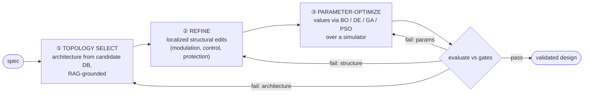

# The Design Loop — topology → refine → parameter-optimize

Across every 2026 PE/analog design agent that **converges to numbers**, the design stage is not one step but three, ending in an **explicit numerical optimizer** over the simulator. The LLM chooses *structure*; a metaheuristic/Bayesian optimizer chooses *values*. This refines "LLM proposes, simulation disposes" into **"LLM proposes structure, optimizer disposes numbers, PLECS is truth."**

## 1. Evidence — four systems, one shape

| System | ① topology | ② refine | ③ optimize | Evaluator |
|---|---|---|---|---|
| **AnalogSAGE** (2025, analog IC) [[analogsage-2025-self-evolving-analog-mas]] | Topology Selection Agent (50-cand DB + memory) | Refinement Agent (bias/compensation) | **Bayesian opt + ngspice** | spec check, ≤3 iters |
| **PHIA/LP-COMDA** (AAAI 2026, DAB) [[phia-lpcomda-2026-physics-informed-pe-agent]] | modulation-strategy select | (in planner) | **PSO/DE/GA over PINN surrogate** | physics-informed surrogate |
| **PE-GPT** (IEEE TIE 2025) [[pe-gpt-2025-multimodal-pe-design]] | Model-Zoo topology reasoning | RAG-guided | **metaheuristic over Model Zoo/Sim Repo** | sim repository |
| **Multi-Agent LLM Control** (2026, boost) [[multi-agent-llm-control-2026-pe]] | objective→control structure | agent-decomposed | **PSO/GA** for gains | simulation, <2% err |

Four converter classes, four teams, same shape. Scope note: this holds for **parametric convergence**; a generation/layout pipeline (ABB Power Circuit AI, SKiDL netlist) optimizes *connectivity*, not parameters — different task, not a counter-example.

## 2. Gap in the SRTP plan

The plan calls parameter work "cheap tool work" but never says **how values are chosen**. A sweep ≠ an optimizer:
- **grid/corner sweep** validates a *given* design across operating points → the Validator's evidence matrix;
- **optimizer** *searches* the space (fsw, deadtime, Rg, C_dc, MI, loop gains) for gate-passing values → the missing Designer inner loop.

Without ③, the only convergence route is LLM-picks → PLECS-validates → LLM-re-picks: token-expensive descent by LLM judgement, the failure Ordonez reports ([[plecs-ai-agent-integration-ordonez]]) and the reason the cited systems use a real optimizer.

## 3. Fix — PLECS-native optimizer, no surrogate required

PLECS-only is compatible with a real optimizer:

| Optimizer | When | Library |
|---|---|---|
| Grid / Latin-hypercube | ≤3 free params; A/B control baseline | scipy / scikit-optimize |
| Differential Evolution / PSO | continuous, parallel; one generation = one PLECS batch | scipy DE, pyswarm |
| Bayesian optimization | eval expensive, ≤~10 dims | Ax/BoTorch, scikit-optimize |

Objective = weighted evidence-gate score (η, Tj margin, THD, cost) from the ~36-number summary; the optimizer sees summaries, never waveforms. DE/PSO map onto PLECS `list-of-optStructs` batch ([[plecs-xmlrpc-scripting-interface]]) — parallelism is free. **Start with grid** on 2L-B6; adopt DE/BO when topology breadth enlarges the space. Surrogates stay a deferred *search accelerator* (optimize over surrogate, verify top-k on PLECS), never an evidence source (PHIA shows ~10-sample bootstrap is feasible if PLECS runtime later dominates).

## 4. Maps to existing agents — no new agents

- **Planner** owns ① (topology + control, RAG-grounded) — the LLM value-add ([[ai-agent-docs-audit-2026-07-17]] §7).
- **Designer** owns ② (template + discrete choices) and drives ③ (optimizer tool over PLECS).
- **Validator** owns evaluate (corner sweep + gates + k=3 consensus) and routes the fail edge to the narrowest stage.

Keeps the 3-agent core intact (AgentSlimming). Named-pattern basis and exclusions: [[agentic-workflow-patterns]].

## 5. Decision

Adopt the three stages as the internal structure of PLAN→DESIGN; add an explicit optimizer as ③ (grid → DE/PSO → BO by dimensionality); route fail edges to the narrowest stage. Surrogates deferred. Folded into [[plan-design-loop]].

## Red Team
**Steelman against:** all four cited systems are converters/analog, none is a 3-phase traction inverter with a motor load; a formal optimizer may be overkill if, once the Planner fixes topology+module, few continuous parameters remain. **How it could be false:** a ≤3-param grid on 2L-B6 may already pass every gate, making ③ ceremony until breadth (3L/ANPC) enlarges the space. **What would change my mind:** a Phase-0 2L-B6 run where grid reliably passes gates → keep ③ as a sweep until a larger space appears. **Residual doubt:** mixed categorical(module)/continuous(gains) search is harder than the cited continuous-only cases; measure a real spec's free-parameter dimensionality before choosing DE vs BO vs grid. The *principle* (explicit search, not LLM re-guessing) is robust; the *specific optimizer* is empirical.

← [[agentic-workflow-patterns]] | [[traction-inverter-mas-integration]] | [[plan-design-loop]] | [[design-by-doing-observed-workflow]] | [[analogsage-2025-self-evolving-analog-mas]]
