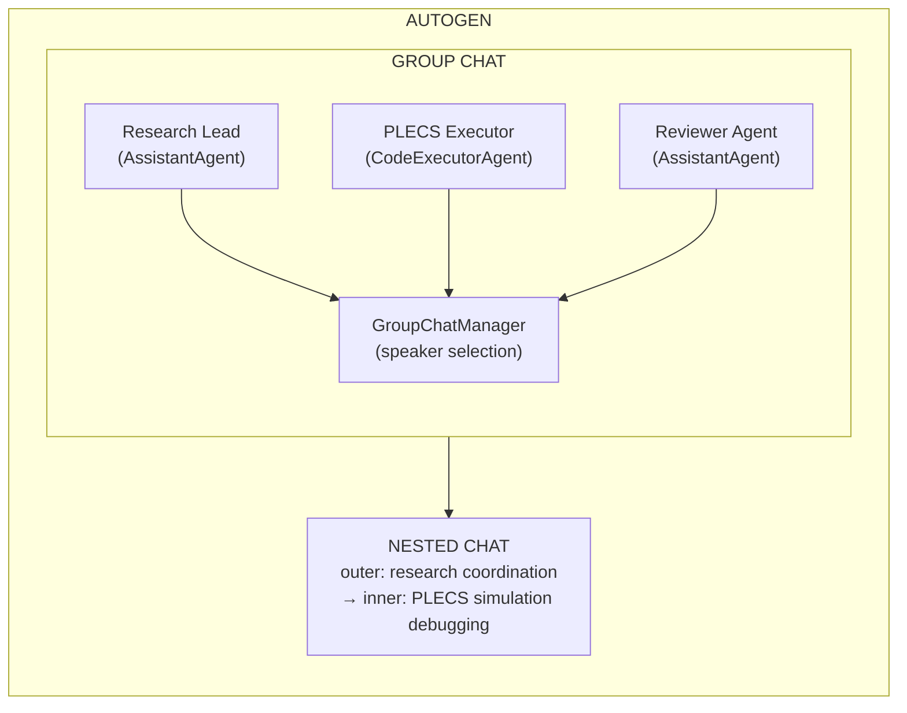

## Overview

AutoGen is Microsoft's **multi-agent conversation framework**. It models agent interactions as message-exchanging conversations. AutoGen v0.4+ (AutoGen Core) adds an event-driven, distributed architecture.

For power electronics research, AutoGen's **group chat** pattern and **code execution agents** suit collaborative research where agents debate approaches before committing to simulations.

## Architecture



### Core Abstractions

| Concept | Description |
|---------|-------------|
| **ConversableAgent** | Base agent that can send/receive messages |
| **AssistantAgent** | LLM-powered agent for reasoning and generation |
| **UserProxyAgent** | Human-in-the-loop or code executor |
| **GroupChat** | Round-robin chat with automatic speaker selection |
| **NestedChat** | Inner chat spawned from outer conversation |
| **CodeExecutor** | Runs code in Docker sandbox or local process |

### Key Features

- **Group chat with speaker selection:** Agents take turns, LLM decides who speaks next
- **Code execution agents:** Run Python/Shell in sandboxed environment
- **Human-in-the-loop:** UserProxyAgent pauses for human approval
- **Nested chat:** Handle sub-problems in dedicated inner conversations
- **AutoGen Studio:** No-code UI for building multi-agent workflows
- **Event-driven architecture (v0.4+):** Pub/sub with Topics and Runtimes

## MATLAB Integration Potential: 🟢 High

AutoGen's code execution agent can run MATLAB scripts directly:

```python
matlab_executor = UserProxyAgent(
    name="MATLAB_Executor",
    code_execution_config={"work_dir": "simulations", "use_docker": False}
)

# Research lead delegates to MATLAB executor
research_lead.initiate_chat(
    matlab_executor,
    message="Run the inverter simulation with Vdc=800V, fs=20kHz, topology=ANPC"
)
# MATLAB executor runs the script and returns results
```

## Strengths

1. **Conversation model** — natural for collaborative research teams
2. **Code execution** — sandboxed, safe execution of MATLAB scripts
3. **Nested chat** — dedicated sub-conversations for debugging
4. **AutoGen Studio** — visual workflow builder
5. **Microsoft-backed** — strong enterprise support

## Weaknesses

1. **CC-BY-4.0 license** — more restrictive than MIT for commercial use
2. **Conversation-centric** — may not map as cleanly to iterative simulation loops as LangGraph's state machine
3. **No native checkpointing** — unlike LangGraph's built-in fault tolerance
4. **Complexity** — more abstraction layers than CrewAI

## Suitability: 🟢 Good

**Role:** Alternative workflow engine when conversation-based collaboration is preferred over state machines.


> **References:** [[citations]]


← [[harness-research-agents|Prev: Research Agents]] | [[README]] →
