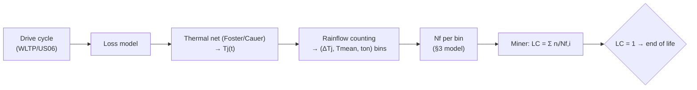

## What This Is

Why modules wear out and how to predict when: CTE-fatigue mechanisms, power-cycling data, lifetime models, mission-profile damage accumulation, and SiC-specific degradation. Turns the qualification names in [[protection-and-safety]] §7 and the material choices in [[packaging-and-layout]] §1 into numbers.

**Citation convention:** `[NN]` → [[citations]]; `[T]` → training knowledge.

## 1. Wear-Out Mechanisms (CTE-mismatch fatigue)

Every Tj swing shears mismatched layers (Si/SiC ~3–4, Al ~23, Cu ~17, Sn-solder ~22, Si₃N₄ ~3 ppm/K) — the bimetallic fatigue engine [139]:

| Mechanism | Site | Stressed by |
|-----------|------|-------------|
| **Bond-wire lift-off / heel crack** | Al wire ↔ die metallization | **fast** cycles (short ton) [139][140] |
| **Die-attach fatigue** (solder/sinter cracks, voids) | chip ↔ substrate → raises Rth | **slow** cycles (long ton) [139] |
| **Substrate delamination** | Cu foil ↔ ceramic (DBC) | baseplate CTE mismatch; AMB-Si₃N₄ resists it [129] |
| Metallization reconstruction | die top metal | fast cycles [140] |

Rule: **PCsec** (ton ~seconds) → wires/metallization; **PCmin** (ton ~tens of s) → die-attach/substrate solder [141]. Cu-clip + sintered-Ag largely remove the wire/solder weak links (§6).

## 2. Power Cycling — Definitions & the Load-Bearing Numbers

- **PC** = self-heating by load current (die + near-die); **TC/TST** = external chamber (whole module, no current) [141].
- Two drivers: **ΔTj** (strain range) and **Tj,max/Tj,mean** (Arrhenius acceleration) [139][140].
- **AQG 324 (Rel 04.1/2025) end-of-life: Rth +20% and/or Vf/VDS(on) +5%**; the 2025 rev added a **dynamic H3TRB** [141][88].

**Real Nf data** (HV traction module, ΔTj=50 K, Tj,max=110 °C — the classic Held/Hamidi set used to fit models) [139]:

| ton | Nf @ +20% Rth | Nf @ +50% Rth |
|----:|--------------:|--------------:|
| 3.1 s | 305,000 | 480,000 |
| 10 s | 110,000 | 186,000 |
| 30 s | 25,600 | 59,400 |

The **12× spread at identical ΔTj** proves dwell (ton/creep) matters as much as amplitude — the core argument against amplitude-only models [139]. Well-designed modules reach **>10⁵–10⁶ cycles at ΔTj≈100 K**, rising steeply (`Nf ∝ ΔTj⁻⁵`) to >10⁷ at ΔTj≈40–50 K [140].

## 3. Lifetime Models

- **Coffin-Manson (+ Arrhenius):** `Nf = a·ΔTj⁻ⁿ·exp(Ea/kB·Tm)`; **n≈3.5–5 for Al wire, n≈2–2.5 for solder** [139]. Limit: ignores ton [139].
- **Norris-Landzberg:** adds cycle frequency `f⁻ⁿ` [139].
- **LESIT / Held:** `Nf = A·ΔTj^α·exp(Ea/kB·Tjm)`, **A=640, α=−5.039, Ea≈0.617 eV** — established that *mean* T, not just ΔTj, sets life [140].
- **CIPS 2008 / Bayerer** (ECPE guideline): folds in ton, current/wire, voltage class, bond-wire diameter — the most complete analytical model [142]. **Coefficients are technology/vendor-specific and must be re-fit per package** — do not reuse IGBT β for SiC (see Red Team) [142].

## 4. Mission Profile → Consumed Life

Standard physics-of-failure chain [143][139]:

**Miner's linear rule**: failure at `LC=1` [139][143]. One profile can be **2.5× more damaging** than another at the same nominal temperatures due to small superimposed oscillations [139] — so counting matters.

## 5. SiC-Specific Degradation (beyond package fatigue)

| Mode | Test | Effect |
|------|------|--------|
| **Gate-oxide Vth drift** (SiC/SiO₂ traps) | HTGB | Vth shift + Ron rise; **~15% (HTGB) vs ~4% (HTRB)** [144][24] |
| **Body-diode bipolar degradation** | body-diode conduction | basal-plane dislocations → Shockley stacking faults → VF/Ron creep; mitigate with SBD co-pack / sync rectification [148] |
| **Short-circuit ruggedness** | SC test | SCWT **~5–14 µs**, 5–10× IGBT current density → tighter desat timing [145][110] |
| **Humidity** | **H3TRB** (85 °C/85% RH, 1000 h, ~80% Vds) | edge-termination/passivation degradation; AQG 324 now dynamic-H3TRB [146][141] |

## 6. Targets & Die-Attach Uplift

- **Automotive life:** ~**15 years / 100k–300k km** (240k common) → module must reach end-of-mission at **LC<1 with margin** across PCsec+PCmin+TC+H3TRB+vibration [147][141].
- **Sintered-Ag vs solder:** low homologous temperature even at Tj=175–200 °C → large PC gains (sinter joints ~2×10⁵ cycles) [147].
- **Interconnect stack:** Danfoss DBB ≈**15×** power cycles vs Al wire; sinter+Cu-clip+mold ≈**3×** lifetime vs baseline [147] (baseline-dependent — see Red Team).

## 7. Condition Monitoring / RUL

- **VDS(on)** (at defined I,T) → **bond-wire/metallization** precursor (the +5% flag) [148][141].
- **Rth(j-c)** → **die-attach/substrate** precursor (the +20% flag) [141].
- **Vth shift** → gate-oxide aging (SiC-specific) [144]. In-situ VDS(on) monitoring feeds RUL on AC power-cycling rigs [148].

## Red Team

**Steelman against:** The chain looks quantitative but its weakest link — Miner's rule — is the least defensible physics, and the model coefficients are technology-specific numbers borrowed across packages. Several uplift figures are vendor marketing with unstated baselines. Presenting `LC=1` and specific β as facts would over-claim.

**How it could be false:**
1. **Miner `LC=1` is an indicator, not a hard failure point** — ignores load-sequence, crack interaction, creep-fatigue coupling; real failures scatter ~0.3–3× LC [139]. Use with a safety factor.
2. **CIPS08 coefficients:** the equation structure is verified [139][142], but the frequently-quoted original Bayerer K/β set could not be confirmed from a primary open source, and a recalibrated set differs materially (β1=−2.91 vs −4.42) [142]. Cite CIPS 2008 directly and **re-fit for SiC** — never reuse IGBT β.
3. **Uplift numbers (15×, 3×, 2×10⁵ cycles)** are different standards/ΔTj/vendors, several from marketing [147] — directional only; pin each to its test conditions.
4. **Nf table is HV-IGBT** [139]; SiC package fatigue scales similarly but the absolute numbers are device-specific.

**What would change my mind:** an AQG 324-referenced PC dataset for the chosen SiC module; a CIPS08 fit re-calibrated on that module; mission-profile lifetime cross-checked by the energy-based (Clech) method [139] against rainflow+Miner.

**Residual doubt:** The *mechanisms, model families, and PoF chain* are solid and well-sourced. Every hard number (β, Nf, uplift ×) is technology-specific and must be re-grounded on the actual module before a lifetime is claimed.

---

> **References:** [[citations]]

← [[packaging-and-layout]] | [[manufacturing-and-test]] | [[protection-and-safety]] →
