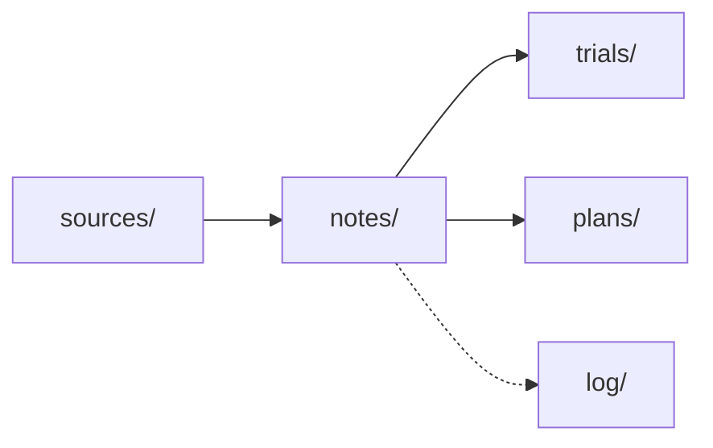

# 2026-07-19 — Vault Refactor

Restructured the vault from **field-first** folders to **stage-first** folders, switched all wikilinks to bare basenames, and moved indexing from hand-kept maps to Obsidian bases. No note content was lost — a mechanical gate verified every citation, number, wikilink, and frontmatter key survived.

## What changed

**1. Folder = lifecycle stage** (was `folder = field`). Top level now reads as the note pipeline:

| Before | After |
|--------|-------|
| `power-electronics/traction-inverter/*` | `notes/power-electronics/*` |
| `ai-agents/`, `ai-agents/harness/`, `ai-agents/agent-papers/` | `notes/ai-agents/*` (flattened) |
| `problem-statement/` | `notes/problem-statement/` |
| worked-examples + design-by-doing inside `power-electronics/` | `trials/` (extracted) |
| `project/plans/` | `plans/` |
| `project/changelog/`, `audits/` | `log/changelog/`, `log/audits/` |
| `sources/<field>/` | unchanged |

Field now lives in frontmatter and one shallow subfolder inside `sources/` and `notes/`. Max depth 3; `harness/`, `traction-inverter/`, `agent-papers/` nesting removed.

**2. Bare-basename wikilinks.** 867 path-based links (`[[power-electronics/traction-inverter/schematics]]`) → bare (`[[schematics]]`). Enabled by a global basename-uniqueness invariant. Files now move between folders without breaking a link.

**3. Base-driven indexes.** `catalog.base` gained a *By stage* view; added per-stage `notes.base`, `sources.base`, `trials.base`, `plans.base`. Navigation no longer depends on hand-maintained lists.

**4. Density pass.** Filler and hedging cut across 70 living notes (`notes/`, `trials/`, `plans/`); `sources/` (immutable) and `log/` (historical) excluded. The corpus was already schema-dense, so gains were targeted, not bulk.

**5. Doc + fix.** [[SCHEMA]] and [[README]] rewritten to the new model; duplicate `Major OEM Inverter Designs` heading in [[index-traction-inverter]] removed.

## Verification

- **No information lost** — per-file gate: every citation `[n]`, numeric literal, wikilink target, and frontmatter key preserved vs. a pre-edit snapshot. Only flags were intended `updated` date bumps.
- **Link integrity** — 0 unresolved wikilinks vault-wide.
- **Bases** — all five `.base` files parse.
- **File count** — 115 `.md` preserved (moved via `git mv`, history intact).

---

← [[changelog-index]] | [[README]]
