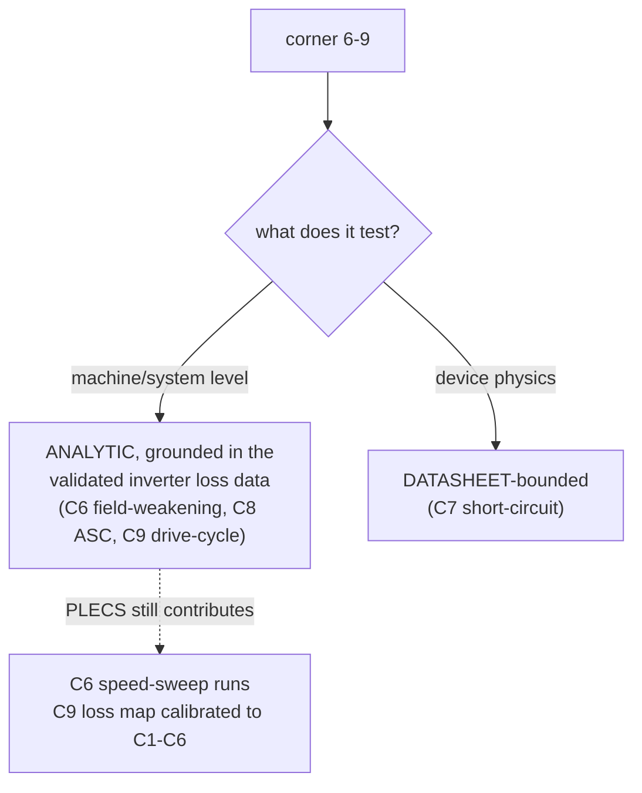

# 2026-07-23 — Track-1 corner matrix finished (corners 6-9) and averaged↔switched reconciled

Continues [[2026-07-21-plecs-2l-b6-model-complete-and-corners]]. That session validated the bench and ran
corners **1-5** (S1-S5), deferring corners **6-9** and **S6/S7** as needing control/fault/averaged models.
This session **completed corners 6-9** and **met S6/S7**, closing the 9-corner matrix of
[[procedure-simulation-and-validation]] §4 for Track-1. Results appended to
[[2l-b6-800v-sic-bench|results/metrics/2l-b6-800v-sic-bench.txt]]; scripts in
`experiments/2l-b6-800v-sic-bench/corner{6,7,8,9}_*.py`.

---

## 1. The scoping decision (why each corner is what it is)

The switched bench is an **open-loop, constant-per-unit grid-style inverter** model — no FOC, no fault
logic, no dq machine (the "machine" is a back-EMF voltage source behind a 0.5 p.u. filter). Per
[[plan-depth-research]]'s can/cannot table, that fixes the honest scope of each remaining corner:

Machine parameters are a **representative 300 kW IPMSM** (`[T]`-class, [[machine-and-load]] §3): λ=0.11 Wb,
Ld/Lq=0.18/0.42 mH, Pp=4 — flagged, not measured.

## 2. Results

**C6 — Field-weakening (750 V).** Analytic envelope: constant-torque ~453 N·m to base speed 5596 rpm
(fe 373 Hz), peak **327 kW** at 14100 rpm, **CPSR 2.4×**. **PASS** torque ∝ ω⁻⁰·⁹¹ (criterion ~1/ω);
**PASS** Vd²+Vq² ≤ Vmax² (100 % utilization on the voltage ellipse); id deepens −264→−490 A (flux weakening).
**PLECS inverter confirmation** at 750 V/300 kW across 1×–3× base speed (fe 200/400/600 Hz, pulse ratio
fs/fac drops 80→27): η **flat 99.11–99.12 %**, crest 1.46→1.53, THD grows as the pulse ratio falls — the
inverter stays efficient across the whole constant-power region.

**C7 — Short-circuit (850 V, hot).** The `MosfetWithDiode` is a constant-Ron loss model with **no
gm-saturation** (verified: no transfer table in the CAB450 XML) — a hard SC would compute 850/0.0036 =
**236 kA**, unphysical. Bounded from the FM3-family anchor ([[protection-and-safety]] §3) scaled to CAB450
by die area (Ron 16/2.6 = 4.44×): **ID,sat ~4.7 kA** (~10× rated), **SCWT ~2.73 µs @ 850 V/175 °C** (< 3 µs
SiC). DESAT (300 ns) + soft turn-off (1 µs) = 1.3 µs reaction, inside SCWT with **2.1× margin → a single SC
is survived**. Turn-off overvoltage ΔV = Lσ·di/dt: soft 63 V vs hard 313 V (89 % of BV headroom) → soft
turn-off strongly preferred. **PASS** (scaling flagged ±30 %).

**C8 — ASC entry (max speed).** Analytic dq integration (bench cannot model ASC). Steady ASC current
**bounded at Ich = λ/Ld = 611 A**; entry transient (RK4 from motoring at the current limit) peaks **1924 A =
3.1× steady** then decays → **exceeds device I_DM (900 A, 214 %)**: flags staged/hybrid ASC or a transient-SOA
check. Drag torque peaks 235 N·m near 100 rpm, falls ~1/ω (controlled braking). **No bus overvoltage** —
fault current circulates in the low-side switches + machine, never reaching the DC-link cap (ΔVbus ≈ 0);
uncontrolled freewheel would rectify 1317 V(LL pk) > 850 V bus and pump the bus. **PASS**: ASC is the correct
high-speed safe state ([[protection-and-safety]] §5).

**C9 — Drive-cycle (averaged).** Loss map `Pcond=9.585e-3·I²ᵣₘₛ + Psw=5.974e-3·Vdc·Irms` fit to the six
validated corners (error < 8 %, mostly < 1 %), driven over a representative US06/WLTP-class trace (280 s /
5 km, rep. 300 kW BEV). **Cycle-average inverter η = 98.62 %** (motoring, energy-weighted) — slightly *below*
the rated-point 99.07 % because low-speed/light-load time carries switching loss set by the full bus; regen
recovers 604 Wh. Tj history (Foster Zjc + CRD-calibrated case→coolant): **peak 116 °C, mean 80 °C** (< 175 °C).
Rainflow: 26 cycles, ΔTj max 28 °C; the Tj(t) + ΔTj bins are the lifetime front-end (absolute Nf/Miner scoped
to [[reliability-and-lifetime]]).

**S6/S7 — reconciliation (now MET).** The corner-9 **averaged loss map reproduces the switched C1–C6 losses
within < 8 %** (target ±10 %). The averaged model *is* the loss map — averaged↔switched reconciliation
demonstrated, no separate state-space-averaged model needed for the loss/efficiency slice.

## 3. Method notes (carry-forward)

| Point | Detail |
|-------|--------|
| Harness re-verified | C1 reproduced byte-for-byte (η 99.068 %, Tj_ss 175.4 °C) before any new work. |
| PLECS speed sweep | `gen_vars.py` holds Lg at 0.5 p.u. per fac (ωLg constant), so raising `fac` cleanly sweeps electrical frequency/pulse ratio at fixed voltage/current — the genuine high-speed inverter knob. Higher fac = more fundamental periods in the fixed 0.05 s run (still integer window). |
| UTF-8 stdout | `analyze_corner.py` prints `Σ`; run with `PYTHONIOENCODING=utf-8` on Windows cp1252. |
| Thermal solver | Explicit Euler on the Cauer ladder is unstable when dt ≫ the fast stage τ (0.1 ms) → NaN. Use a **Foster recursion** (`T=T·e^{-dt/τ}+P·R·(1-e^{-dt/τ})`), unconditionally stable and exact for piecewise-constant loss. |
| Loss-map fit | Least-squares [kc, ks] over the 6 corners; conduction ∝ I², switching ∝ Vdc·I — captures the Eon/Eoff∝V·I scaling. |

## 4. What would upgrade this

Corners 6 and 8 are **analytic** because the bench isn't a machine model. A **native PMSM + FOC** PLECS model
(PLECS ships one, [[machine-and-load]] §8) would upgrade C6 (closed-loop Id/Iq field-weakening) and C8
(PMSM ASC transient) from analytic to PLECS-confirmed. Corner 7 stays datasheet-bounded until a
physics-level (saturation) device model or bench SC data exists. Machine params stay `[T]` until a real
IPMSM datasheet/FEA replaces them.

## 5. Files
- `experiments/2l-b6-800v-sic-bench/corner{6,7,8,9}_*.py` (new — the four corner analyses)
- `experiments/2l-b6-800v-sic-bench/plecs_runs/corners_6_9_output.txt` (captured full output)
- `results/metrics/2l-b6-800v-sic-bench.txt` (corners 6-9 section appended)
- `system/configs/model_registry.json` (2L-B6 entry: corners_6_9 + S6/S7 met)
- root `README.md`, `LOG.md`, `system/src/HANDOFF.md`, memory `plecs-2l-b6-800v-bench`

> **Graph note:** new scripts + changelog + cross-links added — run **`/graphify . --update`** to re-index.
