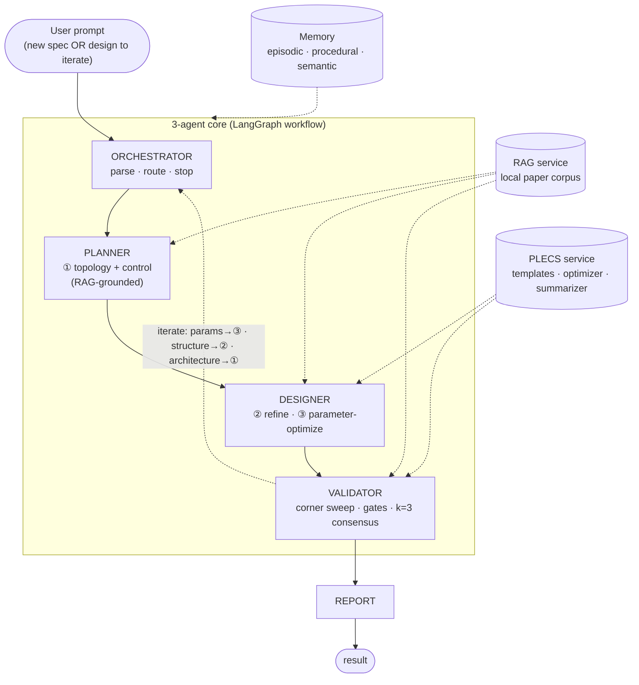
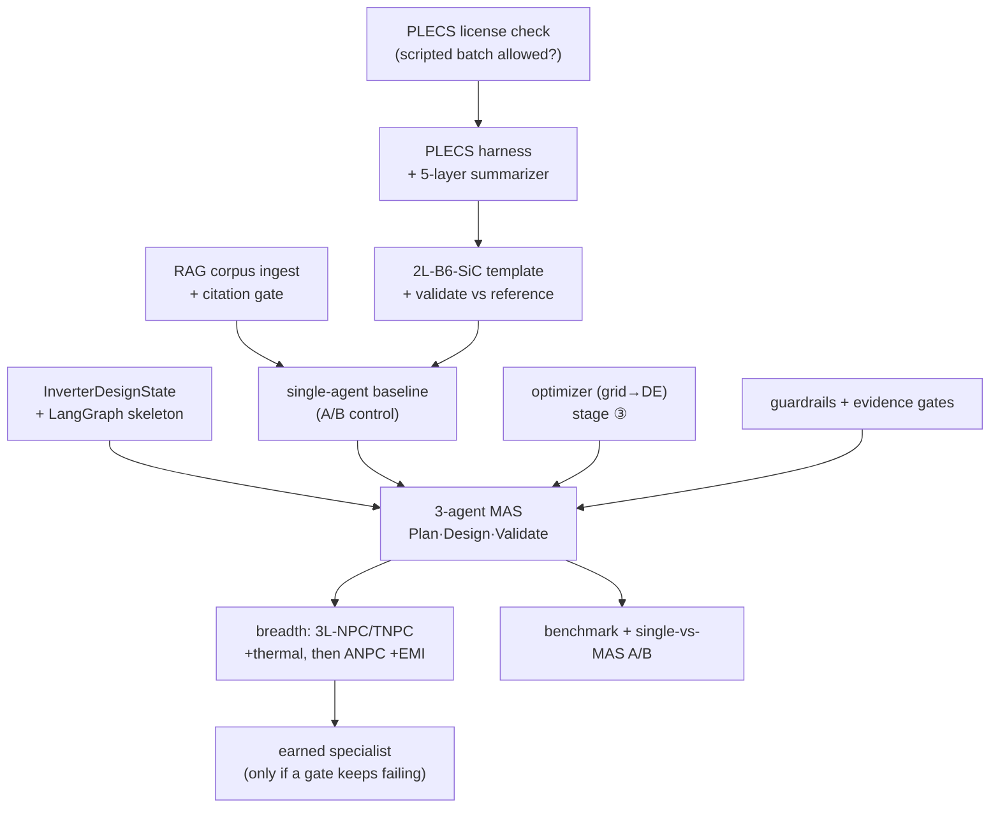

# AI-Agent MAS Plan — Hub

> **The single AI-agent plan, split into topics.** This file is the **hub**: system schematic, invariants, prior-art anchor, topic map, and the build-order DAG. Topics are organized by *subsystem*, not by phase; the build-order DAG (below) gives the split points when the work is phased. Grounded in [[ai-agent-docs-audit-2026-07-17]] and [[plan-sufficiency-review-2026-07-17]].
> **Prior art:** [[pe-mas-flyback-mas]] (adopt its structure). **Backend:** PLECS only. **Knowledge:** RAG over a local research-paper corpus. **No surrogates as evidence** — PLECS is the sole source of truth (a surrogate may later accelerate *search* only; see [[plan-design-loop]]).

---

## 0. What the system does

**One user prompt → a validated traction-inverter design.** The prompt either (a) **designs new** from a spec, or (b) **iterates an existing design** the user supplies. The value the MAS adds is the reasoning a coding-agent cannot do alone — **topology choice, control-strategy selection, physics interpretation, literature grounding** ([[plecs-ai-agent-integration-ordonez]]); everything mechanical (parametrization, sweeps, optimization, regression) is cheap tool work over PLECS.

### System schematic (subsystem view)

The pipeline is a **prompt-chain workflow with an evaluator-optimizer inner loop** ([[agentic-workflow-patterns]]); the DESIGN box is itself the **topology→refine→parameter-optimize** loop ([[design-loop-architecture]]).

---

## Invariants

1. **Ground every design decision in retrieved papers.** No un-cited topology/control choices. RAG is the backbone, not a bolt-on. → [[plan-knowledge-rag]]
2. **PLECS is the only source of evidence.** No PINN/surrogate *as evidence*. If a number isn't from PLECS (or a cited paper), it isn't evidence. → [[plan-plecs-harness]]
3. **Summarize before the LLM.** Engineered ~36-number summaries, never raw waveforms (~1000× token delta). → [[plan-plecs-harness]]
4. **The LLM picks structure; an optimizer picks numbers.** DESIGN converges via an explicit numerical optimizer over PLECS, not LLM re-guessing. → [[plan-design-loop]]
5. **Start at 3 agents; earn specialists against a measured failing gate.** (AgentSlimming.) → [[plan-architecture]]
6. **No "PLECS-backed evidence" without a validated model in the registry.** → [[plan-plecs-harness]]

---

## Prior-art anchor: PE-MAS

Adopt PE-MAS's proven structure ([[pe-mas-flyback-mas]]), re-targeted flyback → traction:

| Adopt from PE-MAS | SRTP use | Topic |
|---|---|---|
| `requirements → designer → validator → reporter` flow | Plan → Design → Validate → Report | [[plan-architecture]] |
| Typed `PowerSupplyState` (~30 fields) | typed `InverterDesignState` | [[plan-architecture]] |
| `plecs-mcp` + XML-RPC (`PE_MAS_PLECS_BACKEND=auto`) | PLECS harness | [[plan-plecs-harness]] |
| Template + `ModelVars` / XML-injection | per-topology validated templates | [[plan-plecs-harness]] |
| `model_registry.json` (per-topology status) | same, traction topologies | [[plan-plecs-harness]] |
| Guardrails + corner-based evidence gates | re-tuned to traction | [[plan-guardrails-and-evidence]] |
| Lifelong memory + iteration playbooks | episodic + procedural memory | [[plan-memory]] |
| Dual-path RAG | elevated to first-class | [[plan-knowledge-rag]] |

**Change from PE-MAS:** flyback → traction (2L-B6, 3L-NPC/TNPC, ANPC + PMSM/IM); provider-agnostic LLMs; RAG central; explicit parameter optimizer; no PINN as evidence.

---

## Topic map

| Topic | Covers | Fills gap |
|---|---|---|
| [[plan-architecture]] | agents, orchestration, shared services, **typed state schema** | G-C |
| [[plan-design-loop]] | topology→refine→**parameter-optimize**, evaluator-optimizer, iterate routing, stopping rule | G-A/B/H |
| [[plan-knowledge-rag]] | corpus, ingestion, citation gate, coverage audit | G-G |
| [[plan-plecs-harness]] | PLECS service, templates, **model-validation procedure + registry**, **5-layer summarizer contract** | G-E/F |
| [[plan-guardrails-and-evidence]] | domain guardrails + evidence gates (the evaluator rubric) | — |
| [[plan-memory]] | episodic · procedural · semantic · isolation; what's deferred | G-D |
| [[plan-tech-stack]] | frameworks, LLM routing, licenses | — |
| [[plan-evaluation-and-benchmark]] | benchmark, single-vs-MAS A/B, open questions, risks | — |

Gap IDs (G-A…G-H) are defined in [[plan-sufficiency-review-2026-07-17]].

---

## Build order (dependency graph — split points for phasing)

Phasing is a cut across this DAG; the dependencies, not the calendar, set the order.

**Natural split points** (each a candidate phase boundary): harness+summarizer+first validated model → single-agent baseline on 2L-B6 (A/B control) → 3-agent MAS with optimizer + gates → topology breadth → earned specialists + hardening. First milestone (definition of done) in [[plan-evaluation-and-benchmark]] §5.

**Hard prerequisite:** the PLECS license check gates everything downstream — do it before harness work.

---

← [[README]] | [[pe-mas-flyback-mas]] | [[plan-sufficiency-review-2026-07-17]] | [[design-loop-architecture]]
