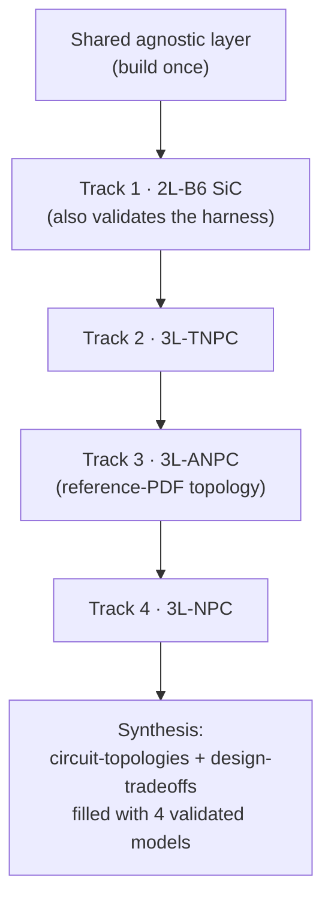

# Depth-research plan — PLECS-first, multi-topology (serial)

> **Mission.** Take every engineering-forward traction-inverter note to the depth of the reference ANPC study (`scratchpad/ref_notes.txt`): every component/node, every equation, sized values with reasoning, a **local PLECS run** that produces the numbers, honest data-quality caveats, and an explicit **safety** section — a **design → test → confirm-safety** guide.
>
> **The real gap is evidence, not authoring** *(audited 2026-07-19, all 31 notes read)*. The notes are derivation-complete and each carries a Red Team with an explicit "what would change my mind." All are `status: unverified` with numbers tagged `[T]`/`[derived]`. So the pass = **execute PLECS + pull the primary source each Red Team names + upgrade `status`** — not re-writing existing derivation.
>
> **Scope — genuinely multi-topology, done serially.** Build a *validated* PLECS model for **each** production/candidate topology, one at a time: **2L-B6 → 3L-TNPC → 3L-ANPC → 3L-NPC** (order = industry relevance; §Topologies). Agnostic notes are written once; each topology gets its own **design note** carrying that topology's validated numbers. Topic of [[plan-ai-agent-mas]]; runs on [[plan-plecs-harness]]. Always cite: `[NN]`→[[citations]], `[T]`=training, `[derived]`=computed. **Next citation: `[166]`.**

## Topologies (serial order + why)

| # | Topology | Switches | Industry relevance | Calibration reference | Special depth |
|---|----------|----------|--------------------|-----------------------|---------------|
| **T1** | **2L-B6 SiC** | 6 | **>95 % of production** (2026); the dominant architecture | **measured** — Wolfspeed/TI 300 kW CRD (>98 % η, 32 kW/L, 360 A rms, 175 °C) | baseline; validates the harness |
| **T2** | **3L-TNPC SiC** | 12 | leading *multilevel* candidate for 800 V BEV; [28] −0.67 kWh/100 km at +30 % chip area | 2L-B6 baseline + [28] | bidirectional NP switch; outer switches block full Vdc |
| **T3** | **3L-ANPC SiC** | 18 | research; **the reference-PDF topology** | 2L-B6 baseline + reference PDF | redundant zero-states (loss balancing), NP balancing, **RLC/damped-LC output filter** (`ref_notes.txt` §9) |
| **T4** | **3L-NPC** | 12 + 6 diodes | industrial/rail baseline; not automotive-production | 2L-B6 baseline + literature | diode clamp, NP balancing (the "Achilles' heel") |

800 V (750 V nominal, 550–850 V range) is the primary class for all four; **400 V is a bus-voltage corner**, not a separate build. Order is by relevance and calibration availability (2L has a measured anchor; the 3L variants calibrate against the validated 2L baseline + their cited papers). Adjustable — a pedagogical build order would be 2L→NPC→ANPC→TNPC.

## What is agnostic vs per-topology

- **Agnostic — write once, reuse (Shared layer):** [[circuit-components]] · [[materials-and-properties]] · [[machine-and-load]] · [[standards-and-compliance]] · [[manufacturing-and-test]] · [[packaging-and-layout]] · [[reliability-and-lifetime]] (fatigue models) · [[open-problems]] · [[segment-low-cost-city-car-inverters]] · [[segment-heavy-duty-truck-inverters]] · [[segment-performance-motorsport-inverters]] · [[bom-price-database]] · [[index-reference-designs]] · [[index-traction-inverter]] · [[procedure-simulation-and-validation]] (the harness/corner-matrix method). [[circuit-topologies]] is the agnostic **topology catalogue**; [[design-tradeoffs]] is the agnostic **cross-topology synthesis**.
- **Per-topology — one instance each (Track deliverable):** a **design note** per topology holding validated numbers, switching states, modulation/NP-balancing, loss distribution, thermal, gate count, protection, output filter, safety margins, BOM delta. 2L-B6 has [[design-2l-b6-800v-sic]]; the scaffolds [[design-3l-tnpc-800v-sic]], [[design-3l-anpc-800v-sic]], [[design-3l-npc-800v-sic]] exist (structure + target + planned validation) and are **filled** as each track runs. Naming scheme: `design-<topology>-<voltage>-<device>`. The agnostic-method notes ([[procedure-design]], [[schematics]], [[control-schemes]], [[procedure-control]], [[design-gate-driver]], [[thermal-design]], [[protection-and-safety]], [[design-emi-emc]], [[bom-2l-b6-sic]]) keep 2L-B6 as their inline worked example; per-topology numbers live in the design notes and the [[circuit-topologies]] comparison.

## Depth bar (the reference PDF)

Topology + every switch/node → gate/PWM equations line-by-line → switching states + dead-time → filter derivation with transfer function + reactance/resonance → power/loss/efficiency with real numbers → solver + `.meas`/`.step` directives → what the run shows and what it does **not** prove → value-selection sweeps → validation workflow. The ANPC PDF sets *rigor*; T3 reproduces its topology directly.

## What each PLECS run can and cannot confirm  *(audit — scope every test to this)*

PLECS validates the circuit/thermal/machine slice with *assumed* device+machine data — not EMC compliance, parasitics, fatigue coefficients, or standards limits (bench/FEA/standard texts).

| Note | PLECS **confirms** | PLECS **cannot** (→ primary/bench) |
|------|--------------------|-------------------------------------|
| [[thermal-design]] | loss→Foster/Cauer→Tj chain; Zth overload; DSC sensitivity | cold-plate Rth-vs-flow, real BLT |
| [[procedure-control]] / [[control-schemes]] | Id/Iq step, THD_i, torque, η, SVPWM +15.5 %, DPWM ~33 %, six-step, field-weakening | IMC-vs-dyno gains, MCU/codegen/HIL |
| [[procedure-design]] / design notes | η/loss-split/Tj/ripple at 3 corners | real module DPT tables, real IPMSM params |
| [[circuit-topologies]] | 2L vs 3L η, THD, dv/dt, NP-balance at equal op point | production-cost multipliers, market shares |
| [[design-gate-driver|gate-driver]] | **double-pulse only**: Vds overshoot, dv/dt & Eon/Eoff vs Rg | `Ig,peak`/`Pdrive` (algebra), CMTI, SCWT |
| [[protection-and-safety]] | **ASC/freewheel + regen overvoltage only**; SC fault current/energy vs SOA | cosmic-ray SEB, FTTI, ISO 26262/AQG qual |
| [[reliability-and-lifetime]] | **only loss→Tj(t) front-end** (shares thermal) → rainflow bins | Nf/Coffin-Manson/LESIT/CIPS08 coeffs, Miner |
| [[design-emi-emc|emi-emc-design]] | **qualitative**: i_CM=C·dv/dt, filter corner/attenuation, reflected-wave ~2× | CISPR 25 dBµV compliance, real spectrum |
| [[machine-and-load]] | saturation-LUT torque within a few % | proprietary/`[T]` Ld/Lq/λ without datasheet/FEA |

**Corollary:** `reliability` and `thermal` share one loss→Tj(t) model. Scope `gate`/`protection`/`emi` to the confirmable subset; label the rest bench/standard.

## Environment & tooling

| Thing | Detail |
|-------|--------|
| Repo | `D:\Engineering Projects\AI\SRTP_PowerElectronicsAI` — git `main`, user Ferrell. Commit only when asked. Python 3.12. |
| **PLECS MCP** | Server `plecs` (installed 2026-07-19, memory `plecs-mcp-setup`). Launch: `PLECS.exe -server 1080` from `C:\Users\ferre\OneDrive\Documents\Plexim\PLECS 4.8 (64 bit)`; RPC `http://localhost:1080`. Tools: `mcp__plecs__ping/open_model/simulate/simulate_advanced/get_component_param/set_component_param/set_component_params_batch/run_script/rpc_call/rpc_batch/circuit_patch/discover_capabilities/list_methods`. |
| PLECS constraints (verified) | Surface = `plecs.load/set/get/simulate/getModelTree/scope/statistics/analyze/codegen/close` (13 methods; no `getConsoleOutput`/`listModels`). **No `plecs.save`** → structural edits are **`.plecs` text then close+`open_model`** (re-loading an open model is stale; this is how each topology variant is built). **No `plecs.add/connect`** → param tuning only via RPC. **Readback = `ToFile`→CSV** (simulate's `Values` is empty in 4.8; corrected 2026-07-19). Single-request/blocking → serialize or ports 1081+. |
| Online research | `WebSearch`; `obsidian:defuddle` (web→md); `WebFetch` (.md/direct). Prefer primary/peer-reviewed → datasheet → standard → vendor. |
| Cross-check | numpy models in `worked-designs/*.py` bound every PLECS number. |
| Subagents | Parallel primary-source gathering (one topic each → cited brief + proposed `[NN]` + red-team). **Author `citations.md` centrally.** PLECS does **not** parallelize on one port. |
| Seed | `worked-designs/family-car-400v-sic/pmsm_mycar.plecs` (retargeted PMSM+FOC demo). Templates in [[procedure-simulation-and-validation]] §1. |

## The per-note loop

## Program

### Shared agnostic layer — build once  *(☐)*
- ⧗ **Harness scaffolding** — **readback blocker CLEARED 2026-07-19**: proven that `mcp__plecs__simulate` returns empty `Values` in 4.8, and that a **`ToFile`→CSV** block yields the data (on both a minimal model and the real 2L-VSI+PMSM; CSV read with numpy). Method captured in [[procedure-simulation-and-validation]] §1 and memory `plecs-readback-tofile`. **Remaining:** extend `pmsm_mycar.plecs` into a reusable **template with a muxed `ToFile`** (η, P_cond/P_sw, THD, Tj, ripple, Vds) + Foster/Cauer thermal net + datasheet-class SiC loss tables; retarget 400 V IGBT → 800 V SiC; start `data/plecs/model_registry.json`. Refs: [[plan-plecs-harness]], [[procedure-simulation-and-validation]] §1–2.
- ☐ **Agnostic notes** (parallelizable via subagents; PLECS-adjacent ones validated during T1): [[machine-and-load]] (real IPMSM datasheet or LUT), [[circuit-components]] (SiC loss delta, DC-link ripple — note says "verify with simulation"), [[what-is-a-traction-inverter]], [[materials-and-properties]], [[standards-and-compliance]], [[packaging-and-layout]], [[manufacturing-and-test]], [[bom-price-database]], [[reliability-and-lifetime]] (models), [[open-problems]], [[segment-low-cost-city-car-inverters]], [[segment-heavy-duty-truck-inverters]], [[segment-performance-motorsport-inverters]], [[procedure-simulation-and-validation]] (execute the 9-corner matrix once T1 exists).

### Per-topology track — repeat serially for T1→T4  *(☐ each)*
Each track is one coherent build. Do **not** start the next topology until the current one is validated + registered.

1. **Model** — write the topology's power stage as a `.plecs` **text** variant of the template (2L 6-switch → TNPC 12 → ANPC 18 → NPC 12+6D); wire top-level Outports. Calibrate: **T1 vs the measured Wolfspeed anchor**; **T2–T4 vs the validated T1 baseline + the cited paper** ([28] for TNPC, the reference PDF for ANPC).
2. **Corner matrix** — run the 9 corners from [[procedure-simulation-and-validation]] §4 (double-pulse, η×3, thermal, ripple, overmod, field-weakening, SC, ASC, drive-cycle); record results.
3. **Design note** — fill the topology unit ([[design-2l-b6-800v-sic]] / [[design-3l-tnpc-800v-sic]] / [[design-3l-anpc-800v-sic]] / [[design-3l-npc-800v-sic]]): switching states, modulation + NP-balancing, loss distribution, thermal, gate count, protection, **output filter** (ANPC: the RLC derivation, `ref_notes.txt` §9), safety margins, BOM delta. Replace `[T]`/`[derived]`.
4. **Fold back** — update the [[circuit-topologies]] comparison row and the per-topology sections of the agnostic-method notes ([[thermal-design]], [[design-gate-driver]], [[control-schemes]]/[[procedure-control]], [[protection-and-safety]], [[design-emi-emc]], [[bom-2l-b6-sic]]) with this topology's validated numbers, scoped per the can/cannot table.
5. **Close** — Red Team → residual doubt; `status`/`evidence`++; `model_registry.json` entry (`validation_status: validated`).

### Synthesis — after all four tracks  *(☐)*
- ☐ Fill [[circuit-topologies]] §5 and [[design-tradeoffs]] with the four validated models (the PLECS Pareto sweep its Red Team demands); regenerate [[index-traction-inverter]] and [[index-reference-designs]].

## Definition of done (per note / per track)

Confirmable-subset claims **PLECS-backed or primary-cited** (or bounded/refuted); each `[T]`/`[derived]` replaced or flagged bench-only; a runnable PLECS artifact + `model_registry` entry with `validation_status: validated`; `status`/`evidence` updated; **Red Team re-run to residual doubt**; links + frontmatter validate. A number is evidence only if its model is validated in the registry ([[plan-plecs-harness]] §3).

## Gotchas

- **Readback:** `simulate`'s `Values` is empty in 4.8 even with Outports — route signals (muxed) into a `ToFile`→CSV and read from disk. After any `.plecs` edit, **close then reload** (stale-model trap).
- **Concurrency:** one PLECS port is blocking — never fan serial PLECS calls from parallel subagents.
- **No `plecs.save`:** each topology variant is a `.plecs` text edit then `open_model`.
- **Model fidelity:** the generic SiC switch model has no real Eon/Eoff/Coss/temperature — efficiency isn't production-accurate until calibrated loss/thermal tables load (reference PDF §5). State in every efficiency caveat.
- **Don't over-claim PLECS:** for gate/protection/emi/reliability, PLECS confirms only the subset above.
- **Serial discipline:** finish and register a topology before starting the next; keep the shared agnostic layer topology-neutral.
- **Historical `log/` files** reference the old structure — do not "fix" them. Linter re-stamps frontmatter (benign); git warns LF→CRLF (benign).

← [[plan-ai-agent-mas]] | [[plan-plecs-harness]] | [[procedure-simulation-and-validation]] | [[index-traction-inverter]]
