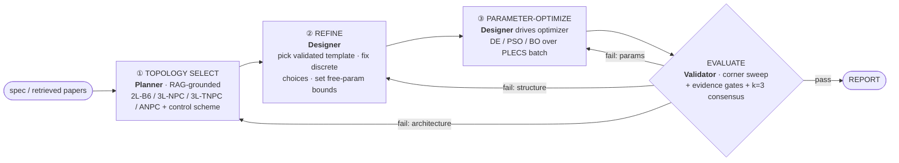

# The Design Loop

> Topic of [[plan-ai-agent-mas]]. Fills G-A (missing optimizer), G-B (black-box design), G-H (unnamed evaluator-optimizer). Research basis: [[design-loop-architecture]], [[agentic-workflow-patterns]].

## 1. Three internal stages (inside PLAN→DESIGN)

The LLM owns ① (and the structural decisions in ②) — the irreducible reasoning value-add. A **numerical optimizer** owns ③. This is *"LLM proposes structure, optimizer disposes numbers, PLECS is truth."*

## 2. Stage ③ — the explicit optimizer (gap G-A)

**Default: Differential Evolution or PSO over PLECS `list-of-optStructs`.** One optimizer generation = one batch call PLECS distributes across CPU cores ([[plecs-xmlrpc-scripting-interface]]) — the parallelism is free.

| Optimizer | When | Library |
|---|---|---|
| **Grid / Latin-hypercube** | ≤3 free params; the A/B control baseline | `scipy` / `scikit-optimize` |
| **Differential Evolution / PSO** | continuous, parallel-friendly, medium dim | `scipy.optimize.differential_evolution`, `pyswarm` |
| **Bayesian optimization** | each PLECS eval expensive, ≤~10 dims | Ax/BoTorch, `scikit-optimize` |

- **Objective** = weighted evidence-gate score (η, Tj-margin, THD, cost) from the ~36-number PLECS summary. The optimizer never sees waveforms.
- **Mixed space:** module choice is *categorical* (handled in ② by the Designer/Planner); the optimizer searches the *continuous* residual (fsw, deadtime, Rg, C_dc, MI, loop gains). Measure the free-param dimensionality of one real spec before committing DE vs BO ([[design-loop-architecture]] red-team).
- **Surrogate = deferred search accelerator only.** If PLECS runtime dominates, bootstrap a physics-informed surrogate at ~10 samples (PHIA), optimize over it, verify top-k on PLECS. Never an evidence source (invariant #2). Off by default.

## 3. The evaluator-optimizer contract (gap G-H)

Name it plainly ([[agentic-workflow-patterns]] §3):
- **Rubric** = the evidence gates ([[plan-guardrails-and-evidence]]) — explicit, measurable.
- **Judge** = the Validator's **k=3 consensus** on a **separate model/context** from the generator (DRCY).
- **Optimizer** = stage ③ (numerical) for params; the Planner/Designer LLM for structure/architecture.
- **Stopping rule:** stop when all gates pass, OR `iteration == max_iter` (return **best_candidate**), OR the Planner declares the spec infeasible with cited reason. Always track `best_candidate` (PE-MAS).
- **Trace compaction:** each iteration compacts its reasoning trace ([[plan-memory]]) so the loop does not reinflate context (AnalogSAGE Compression Module).

## 4. Failure→stage routing (the `iterate` edge)

Route to the **narrowest** responsible stage — cheapest fix first:

| Failing gate | Route to | Rationale |
|---|---|---|
| efficiency slightly below target, THD marginal | ③ re-optimize params | try harder search before changing anything |
| thermal fail, component stress | ② refine (bigger module / different template detail) | structural, not just numeric |
| topology cannot physically hit η/THD target at any params | ① re-plan (new topology, RAG-grounded) | architecture-level |
| spec self-contradictory | stop: infeasible | don't burn iterations |

Explicit mapping, **not** learned routing — enough at this depth ([[agentic-workflow-patterns]] §4).

## 5. Both prompt modes

- **design_new:** full ①→②→③.
- **iterate_existing:** parse the supplied design into state, **skip ① unless the user asks to reconsider topology**, enter at ② (refine) / ③ (optimize) to improve it. Acceptance: the iterate path demonstrably improves a supplied design on at least one gate without regressing others.

← [[plan-ai-agent-mas]] | [[plan-architecture]] | [[plan-guardrails-and-evidence]] | [[design-loop-architecture]]
