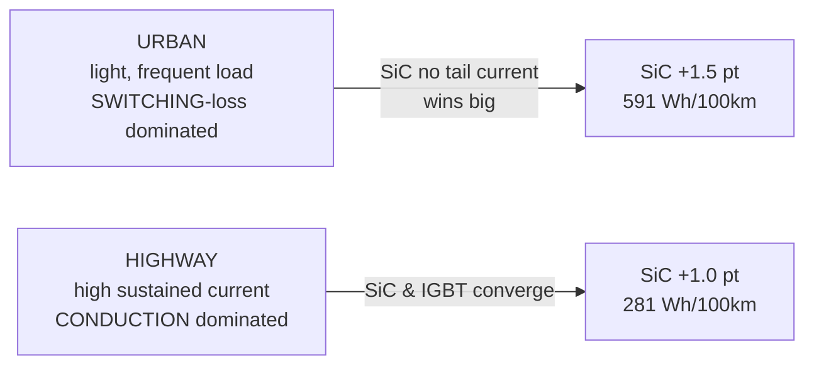

## What This Is

The **new knowledge** that fell out of building and running the family-car design ([[worked-example-family-car-400v-sic]]) — things the vault's prose asserted qualitatively or never had numbers for, now computed with a runnable model (`worked-designs/family-car-400v-sic/`). Each finding carries how strongly the *result* holds vs the *magnitude*.

**Citation convention:** `[NN]` → [[citations]]; `[model]` → computed by the design script; `[T]` → training/undergrad knowledge.

## Finding 1 — SiC's cycle advantage is switching-loss-driven, so it is ~2× larger in the city than on the highway  `[model]`

The headline. For the same inverter, SiC beats Si-IGBT by **+1.5 efficiency points and 591 Wh/100 km in urban** driving but only **+1.0 point and 281 Wh/100 km in mixed/highway** driving.

**Why:** urban duty is dominated by many light-load switching events, exactly where SiC's absence of IGBT tail-current pays; highway is dominated by high sustained conduction, where the IGBT's flat `Vce` knee nearly matches SiC's `I²·Rds`. This **quantifies** the vault's repeated qualitative claim that "partial-load, not peak, is where SiC pays" [28], [[design-tradeoffs]]. **Robustness:** the *direction and ordering* are robust; the *magnitude* scales with the assumed `Esw` ratio (SiC 9 mJ vs IGBT 32 mJ) and the synthetic cycle, so treat 2× as "roughly double," not exact.

## Finding 2 — At launch currents the SiC conduction loss exceeds the IGBT's  `[model]`

At the low-line/high-current corner (≈400 A rms, 280 V bus) the model gives **SiC conduction 2230 W vs IGBT conduction 2122 W** — the IGBT is *lower*. The IGBT's voltage-source knee (`Vce0`+`Rce·I`) grows linearly, while the SiC MOSFET's `I²·Rds` grows quadratically and overtakes it at extreme current. SiC still wins the corner **only because its switching loss is ~2× lower** (202 W vs 480 W).

**Implication:** at 400 V the SiC advantage is *fundamentally a switching-loss advantage*, not a conduction one — so (a) a cost-optimized family car can run SiC at **modest `fsw`** and still win, and (b) the conduction penalty reinforces the case that SiC's conduction strength shows at **800 V / lower current** [[worked-example-400v-150kw]], [28]. This nuance is absent from the vault's device chapter.

## Finding 3 — The IGBT variant is thermally marginal at family-car peak  `[model]`

On the same single-side pin-fin cooler (`Rth`≈0.30 K/W, 65 °C coolant), 135 kW peak gives **SiC Tj ≈ 155 °C** (20 °C margin) but **IGBT Tj ≈ 173 °C — 2 °C under its 175 °C limit**. Device choice therefore **couples to cooling cost**: an IGBT family car at this peak needs a better cooler (double-side / bigger plate) or a peak-power derate, eroding the IGBT's die-cost advantage. The vault treats device and cooling as separate chapters; here they are one decision.

## Finding 4 — Vehicle physics should *set* the operating points, not be assumed  `[method]`

Every prior vault example picks `Is,max` and the "3 corners" by assertion `[T]`. Deriving them from the **road-load equation** `F = mg·Cr + ½ρCd·Af·v² + m·a` [30] makes `Is,max` (≈400 A) an *output* of {mass, `Cd`, gearing} and lets the drive-cycle *duty distribution* — not a single point — weight the loss integral. This is the missing top of the design funnel: **vehicle → (T, ω) map → inverter loss**. Recommend the procedure-design adopt a "§0.5 vehicle road-load" step feeding [[procedure-design]] §1.

## Finding 5 — The PLECS blocker is cleared  `[tooling]`

The vault's status line flagged "PLECS license check" as the top open item [[README]]. Confirmed this session: **PLECS 4.8 Standalone is licensed and driveable headless via XML-RPC** (`PLECS.exe -server`, methods `plecs.load/set/simulate/get`), and a **2L-VSI + IPMSM + FOC drive retargeted to this machine simulated to completion** [58][78][72]. The remaining gap is *result readback* (top-level outports on torque/current/loss), not tool access — a much smaller task than "does PLECS run here at all." Also confirmed: the RPC surface has **no circuit-building or `eval` methods** (only `load/set/get/simulate/scope/…`), so agent-built models must start from a `.plecs` template and be parameterized, not assembled from scratch [72]. And PLECS ships **ready drive templates** to seed from — `permanent_magnet_synchronous_machine` (2L-VSI+PMSM+FOC), `electric_vehicle_with_active_damping`, `look_up_table_based_pmsm` — the "native PMSM/FOC demo" the plan assumed [80], now named. Full verified cheat-sheet: [[procedure-simulation-and-validation]] §1; harness impact: [[plan-plecs-harness]] §1.

## What to Do Next

1. Add top-level outports (torque, `i_abc`, device losses) to the retargeted `.plecs` and reproduce §4 corner efficiencies **in PLECS** — the switching-resolved confirmation.
2. Replace the synthetic cycles with the official **WLTP class-3** trace; re-report the SiC-vs-IGBT Wh/100 km.
3. Pull **real 750 V SiC + IGBT module datasheets** ([99] class) to replace the `[T]` loss params; the SiC-IGBT gap is sensitive to their `Esw` ratio.

## Red Team

**Steelman against:** These are outputs of one self-authored quasi-static model with invented device parameters — dressing up assumptions as discoveries. Finding 1's "2×" and Finding 2's crossover both fall directly out of the numbers I chose for `Esw` and `Rds`; a different (equally defensible) parameter set could shrink or move them. None is confirmed by PLECS switching simulation or hardware.

**How it could be false:**
1. **Parameter-driven:** Findings 1–3 scale with the assumed loss coefficients [25]; the *rankings* are robust (SiC lower switching loss, IGBT flatter conduction knee are physics [22][50]), the *crossover current* and *2× ratio* are soft.
2. **Cycle is synthetic** — aggressive launches inflate absolute urban loss; a gentler WLTP trace would lower the Wh/100 km and possibly the urban/highway ratio.
3. **Thermal margin (Finding 3)** uses one `Rth` estimate; a real module + cooler could move IGBT Tj either side of its limit.
4. **Finding 4 is a method claim**, not a measured result — its value is in reframing, and it could be seen as obvious.

**What would change my mind:** PLECS-with-loss-tables (or hardware) reproducing the corner efficiencies and the conduction crossover; the WLTP trace changing the urban/highway ratio materially; real datasheet loss data narrowing the SiC-IGBT `Esw` gap.

**Residual doubt:** As *directional engineering knowledge* grounded in device physics and internally consistent, these hold and are genuinely new to the vault. As *quantitative claims* they are a computed, inspectable hypothesis — the next rung above the vault's prior "closed-form, replace with PLECS" numbers, and the rung below a PLECS/hardware result.

---

> **References:** [[citations]] · model: `worked-designs/family-car-400v-sic/familycar_inverter.py`

← [[worked-example-family-car-400v-sic]] | [[design-tradeoffs]] | [[open-problems]] →
