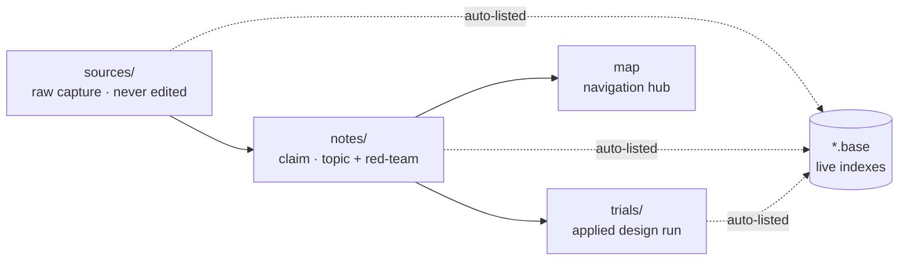
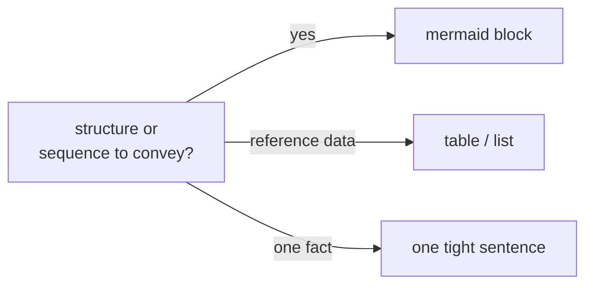
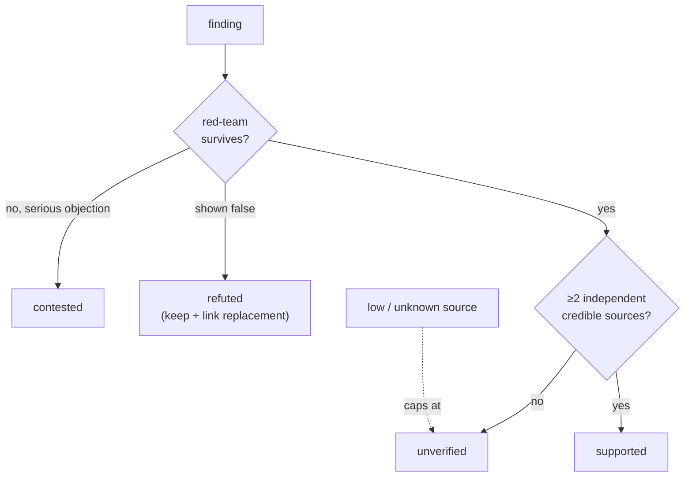
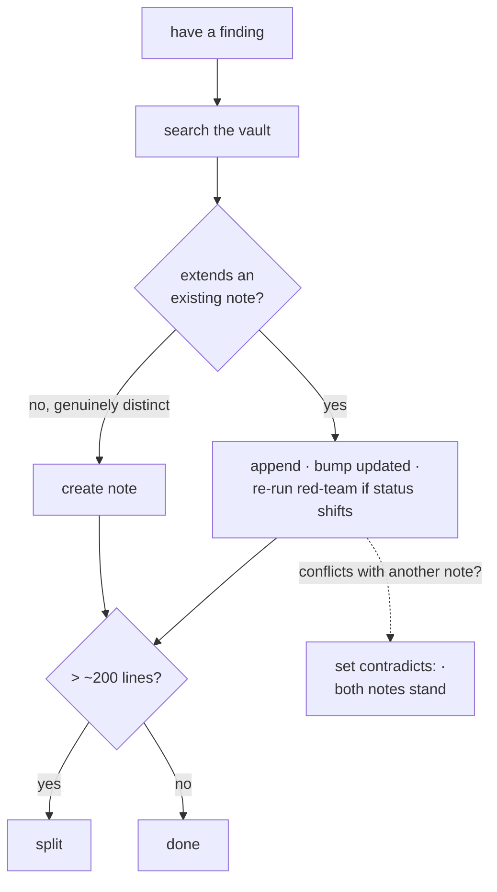

# SRTP Research Vault — Schema

> The rules every file obeys. Plain-English folders, metadata on every file, and truth-status + evidence + red-team on every claim.
> Root: `D:\Engineering Projects\AI\SRTP_PowerElectronicsAI\srtp_docs`

---

## Folder = Stage

The top-level folder a note lives in **is** its lifecycle **stage**. `field` lives in frontmatter, mirrored by one shallow subfolder inside `sources/` and `notes/`. Bases — not deep folders — do the indexing.

| Folder | Stage | `field` | Holds |
|--------|-------|---------|-------|
| `sources/<field>/` | raw capture | matches subfolder | Immutable source, one per paper. Never edited. |
| `notes/<field>/` | digested | matches subfolder | Claims, topics, maps. `<field>` = `power-electronics` (traction-inverter textbook), `ai-agents` (agent architectures), `problem-statement` (motivation/preface). |
| `trials/` | applied | per note | Worked design examples + design-by-doing runs. Runnable artifacts live outside the vault in `worked-designs/`. |
| `plans/` | plan | `project` | Implementation plans (`ai-agent-mas-plan` hub + subsystem topic files). |
| `log/changelog/`, `log/audits/` | operational | `project` | Dated change records and vault self-audits. |
| root `/` | index | `root` | Singletons — `README`, `SCHEMA`, `citations`, and the `.base` indexes (`catalog`, `notes`, `sources`, `trials`, `plans`). |

Research content notes (`claim`/`topic`/`source`) live **only** under `sources/` or `notes/`. Navigation hubs (`type: map`) live in `notes/<field>/`. Indexing is base-driven: [[catalog.base]] is the master, one `.base` per stage. Deep per-topic folders (`harness/`, `traction-inverter/`) were flattened — the stage folder plus frontmatter + bases carry the structure.

Every note flows through the same pipeline:



---

## Writing Style

Every note body is **clear, dense, and concise**, and uses a **mermaid diagram wherever one beats prose**.

- **Clear** — one idea per sentence; state the conclusion first, then support it. Plain English, like the folder names. Define or link a term on first use.
- **Dense** — every sentence earns its place. Cut filler ("it should be noted", "in order to", "very"). Numbers beat adjectives: `~40% lower loss at 100 kHz, 650 V`, not "much lower". Use tables for reference data and lists for enumerations.
- **Concise** — say it once. Don't restate the same point across sections. Keep notes under ~200 lines; past that, split (see [Lifecycle](#lifecycle)).
- **Diagram-first** — for anything **structural or sequential**, use a ` ```mermaid ` block instead of ASCII art or a paragraph that describes shape. Reach for it on: circuit/topology structure, control loops, agent graphs, pipelines, state machines, and decision flows. One diagram = one idea; label the edges. If mermaid genuinely can't express it (a real schematic), say so and cite the figure.
- **Formatting** — `code` for filenames, identifiers, and parameters; **bold** for the single key term of a paragraph; Obsidian callouts (`> [!note]`) sparingly.



---

## Metadata

No file ships without YAML frontmatter. Four **identity** keys are mandatory on every `.md`, plus a date:

```yaml
---
title: Human-readable title
type: <see Note Types>
field: power-electronics | ai-agents | problem-statement | project | root
created: YYYY-MM-DD        # authored notes
updated: YYYY-MM-DD        # authored notes
tags: [<from Tag Taxonomy>]
---
```

Two note kinds extend it:

**Claim / topic** add the research fields:
```yaml
status: supported | contested | refuted | unverified
evidence: replicated | single-study | theoretical | disputed
sources: [sources/ai-agents/foo, doi:10.1234/xyz, arxiv:2401.01234]
contradicts: [slug-of-conflicting-note]   # omit if none
review_by: YYYY-MM-DD
```

**Source** (`type: source`) keep the four identity keys but date with a single `captured` (not `created`/`updated`), and add provenance:
```yaml
authors: [...]
year: YYYY
venue: "journal / conference / preprint server"
doi: 10.1234/xyz          # or arxiv: / pmid:
captured: YYYY-MM-DD
reliability: high | medium | low | unknown
peer_reviewed: true | false
motivated: true            # omit if not
reliability_note: "..."
```

---

## Note Types

| `type` | Lives in | Purpose | Red-team? |
|--------|----------|---------|-----------|
| `source` | `sources/<field>/` | Immutable capture of one source. Never edited. | no |
| `claim` | `notes/<field>/` | One defensible finding + evidence. Carries status + evidence. | **required** |
| `topic` | `notes/<field>/` | Synthesis across claims/papers — state of knowledge. | if it advances a position |
| `map` | `notes/<field>/` | Navigation hub. Pure wayfinding. | no |
| `trial` | `trials/` | Worked design example / design-by-doing run. | no |
| `plan` | `plans/` | Implementation plan / architecture decision. | no |
| `changelog` | `log/changelog/` | Dated record of what changed. | no |
| `audit` | `log/audits/` | Lint report or vault self-audit. | no |
| `schema` / `citations` | root | Root singletons besides README. Indexes are `.base`, not `.md`. | no |

**Claim vs topic** — a claim defends *one* checkable finding ("SiC switching loss ~40% below Si IGBT at 100 kHz, 650 V"); a topic synthesizes many ("wide-bandgap adoption in traction inverters"). One sharp result → claim. A landscape → topic linking its claims.

**Operational vs research** — `plan`, `changelog`, `audit` carry the base block but **no** status/evidence/red-team. They record decisions, not defensible findings.

---

## Truth-Status  *(claim/topic only)*

New claims default to **`unverified`** — never `supported`. Earn it:



- `supported` — 2+ independent credible sources; red-team failed to break it.
- `contested` — credible sources disagree, or the red-team raised a serious unresolved objection.
- `refuted` — evidence shows it false. Keep the note as a record; link what replaced it.
- `unverified` — single source, unknown-reliability source, or not yet cross-checked.

## Evidence-Strength  *(claim/topic only)*

- `replicated` — independent groups reproduced it; meta-analysis or multiple confirmations.
- `single-study` — one (or a few, not independently reproduced) papers.
- `theoretical` — derived/modeled/simulated, not yet empirically tested.
- `disputed` — replication attempts conflict or have failed.

## Source Reliability

- **high** — primary/original: peer-reviewed papers in credible venues, standards bodies, direct experimental reports.
- **medium** — solid secondary: reputable preprints, reviews, textbooks, well-run informal reproductions.
- **low** — weak/motivated: press releases, vendor whitepapers, marketing, single blog posts, un-refereed theses.
- **unknown** — provenance unassessable.

`peer_reviewed: false` is not automatically low — a preprint from a strong group is often `medium` — but it caps a single-source claim at `unverified` until peer-reviewed or reproduced. **`motivated` is orthogonal to reliability** (a vendor's own well-run benchmark can be `high` *and* `motivated`); it does **not** gate status. **Reliability gates status:** a `low`/`unknown` source alone can't push a claim past `unverified`.

---

## Red-Team Block  *(mandatory on claim notes)*

No red-team, no claim.

```markdown
## Red Team
**Steelman against:** [Strongest good-faith case the finding is wrong or overstated.]
**How it could be false:** [Concrete mechanism — small n, p-hacking, no controls, cherry-picked regime, unreproduced, motivated funding, sim≠reality, measurement artifact.]
**What would change my mind:** [Specific result that would flip status or evidence.]
**Residual doubt:** [One line — what still nags after reading.]
```

---

## Tag Taxonomy

Every tag must already exist here. Add to the list first, then use.

**Fields:** `power-electronics`, `ai-agents`

**Power Electronics**
- *Topologies:* `topology`, `inverter`, `two-level`, `three-level`, `multilevel`, `npc`, `t-type`, `anpc`
- *Components:* `mosfet`, `igbt`, `gan`, `sic`, `diode`, `capacitor`, `dc-link`, `gate-driver`
- *Modulation:* `pwm`, `svpwm`, `dpwm`, `she-pwm`, `hysteresis`, `mpc`
- *Thermal:* `thermal`, `heatsink`, `junction-temperature`, `cooling`, `thermal-resistance`
- *Control:* `foc`, `dtc`, `sliding-mode`, `observer`, `sensorless`, `pi-control`
- *Performance:* `efficiency`, `thd`, `ripple`, `emi`, `power-factor`, `dvdt`, `switching-loss`
- *Standards:* `ieee`, `iec`, `iso`, `mil-std`, `aec-q`, `standards`
- *Domain:* `traction-inverter`, `market-research`
- *Design:* `design`, `reference-design`, `schematic`, `bom`, `sizing`, `busbar`, `protection`, `packaging`, `example`, `trade-off`, `reliability`
- *Method:* `tuning`

**AI / Agent Architecture**
- *Frameworks:* `claude-code`, `codex-cli`, `opencode`, `hermes-agent`, `langgraph`, `crewai`, `autogen`
- *Concepts:* `multi-agent`, `tool-calling`, `delegation`, `orchestration`, `subagent`
- *Architecture:* `architecture`, `patterns`, `comparison`, `integration`, `gui-vs-cli`
- *Engineering AI:* `plecs`, `simulation`, `code-generation`, `design-automation`, `engineering-ai`

**Cross-cutting**
- *Method:* `experiment`, `simulation`, `theory`, `dataset`, `benchmark`, `review`
- *Evidence:* `replication`, `reproducibility`, `ablation`, `baseline`, `n-size`
- *Meta:* `contested`, `open-problem`, `sota`, `prediction`, `preprint`, `retracted`, `index`, `audit`, `synthesis`
- *Operational:* `plan`, `changelog`

---

## Naming & Linking

- **Filenames are kebab-case** — `traction-inverter-index.md`, never `Traction Inverter Index.md`.
- **Basenames are globally unique.** This is the invariant that makes the next rule safe — check it before naming a new note.
- **Wikilinks are bare basenames** — `[[components]]`, never a path. Files then move between folders without breaking a link. Labels and anchors are fine: `[[components|Label]]`, `[[components#Section]]`.
- **Sources are referenced by path** in the `sources:` list, matching the file under `sources/<field>/`.
- **Titles are specific** — the `title:` names the exact subject, not a generic word (`3L-ANPC · 18-switch · 800 V SiC Traction Inverter`, not `ANPC`).

### Naming schemes (power-electronics design cluster)

Where a family of notes shares a shape, the filename follows a fixed scheme so the set groups and sorts together:

| Scheme | For | Example |
|--------|-----|---------|
| `design-<topology>-<voltage>-<device>` | **topology units** — our own PLECS-validated designs, one per topology | `design-2l-b6-800v-sic`, `design-3l-tnpc-800v-sic`, `design-3l-anpc-800v-sic`, `design-3l-npc-800v-sic` |
| `reference-design-<source>-<class>` | **external references** — vendor CRDs and production teardowns we cite/calibrate against | `reference-design-wolfspeed-ti-300kw-800v`, `reference-design-tesla-model3-400v-sic` |
| `procedure-<method>` | **method / how-to notes** — the repeatable procedures a design follows | `procedure-design` (sizing), `procedure-control` (FOC), `procedure-simulation-and-validation` (the PLECS validation SOP) |
| `segment-<market>-inverters` | market-segment landscapes | `segment-heavy-duty-truck-inverters` |

Keep the three cluster families distinct: our validated designs (`design-*`, evidence we produce), external references (`reference-design-*`, anchors we cite), and procedures (`procedure-*`, the method the designs follow). PLECS-derived numbers are evidence only after clearing the SOP in `procedure-simulation-and-validation` §4 (S1–S7).

---

## Lifecycle

**Append-first** — search before you create.



- **Contradictions surface, never overwrite** — set `contradicts:` and let both notes stand.
- **Delete** superseded *operational* docs (git keeps history). **Never delete** a research note that was ever `supported` or `contested` — mark it `refuted` and link its replacement.

---

← [[README]] | [[catalog.base]] | [[traction-inverter-index]] | [[harness-index]]
