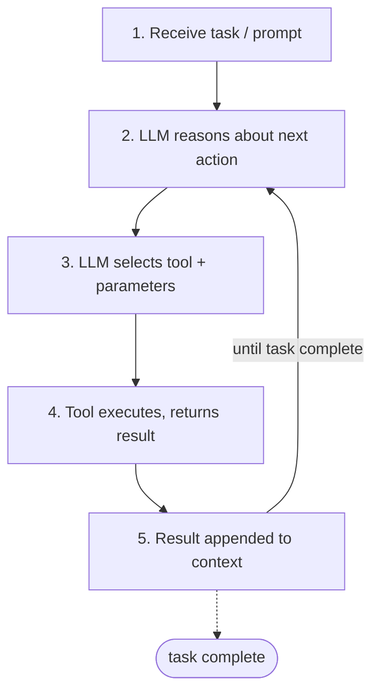
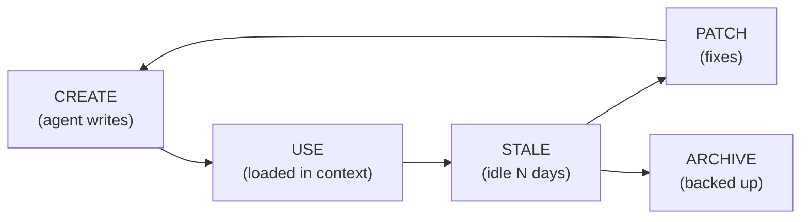
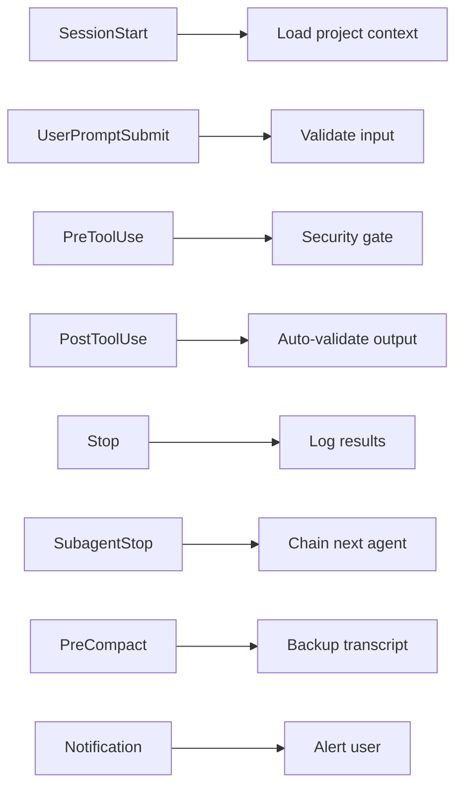
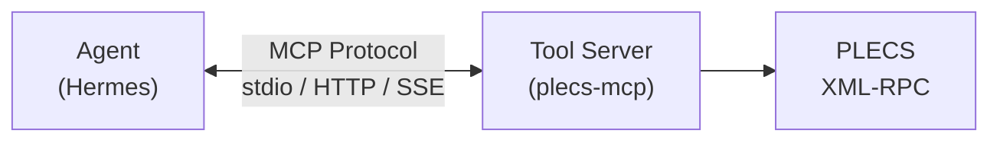
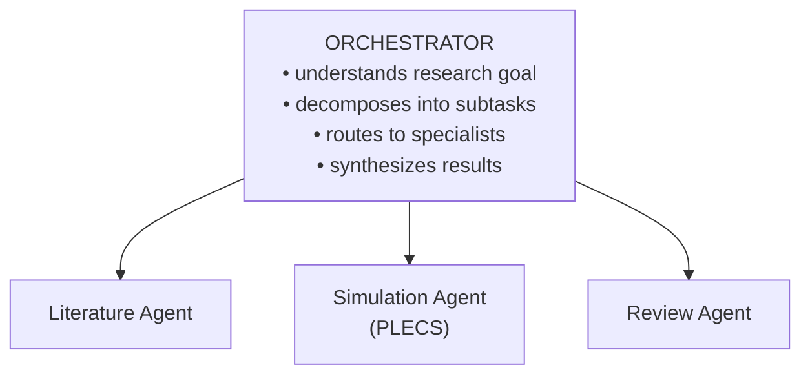

## Pattern 1: ReAct Loop (Universal)

**Used by:** All surveyed harnesses


<small>Configurable: max_turns, temperature, context-compression threshold.</small>

**Relevance:** All surveyed harnesses implement this pattern. For research workflows, longer max_turns (50-100) accommodates multi-step simulation-analysis cycles, compared to coding tasks (10-30).

## Pattern 2: Skills / Self-Improving Knowledge (Hermes-Unique)

**Used by:** Hermes Agent only



**Relevance:** Skills enable domain knowledge accumulation. Simulation workflows, topology selection heuristics, MATLAB debugging procedures, and loss analysis methodologies can all be encoded and improved over repeated use.

**Skill examples for power electronics:**
- `inverter-design-workflow` — step-by-step process from spec to component selection
- `matlab-simulation-debugging` — common MATLAB errors and fixes
- `topology-selection-heuristics` — decision tree for choosing topology by spec
- `loss-analysis-methodology` — conduction + switching loss calculation procedure

## Pattern 3: Hooks / Event-Driven Automation (Claude Code)

**Used by:** Claude Code



**Relevance:** PostToolUse hooks enable automated output validation. After simulation: verify output file creation, check efficiency bounds (0-100%), validate waveform dimensions, and detect NaN/inf values. This catches garbage results before they pollute downstream analysis.

## Pattern 4: Granular Tool Permissions (Claude Code)

**Used by:** Claude Code

```
Bash(git *)            # Only git commands
Bash(python *)         # Only python
Bash(matlab *)         # Only matlab batch
Bash(pytest *)         # Only pytest
Write(*.m)             # Only MATLAB files
Write(*.slx)           # Only Simulink models
```

**Relevance:** Granular permissions enable safe MATLAB execution. Pattern syntax allows: `Bash(matlab *)` for scripts, `Bash(simulink *)` for model compilation, `Write(*.m)` for script creation, while blocking dangerous operations like `Bash(rm *)` or `Bash(sudo *)`.

## Pattern 5: MCP Tool Server (Claude Code, Hermes Agent)

**Used by:** Claude Code, Hermes Agent



**Relevance:** MCP provides the cleanest integration pattern for external tools like MATLAB. A MATLAB MCP server wrapping the Engine API provides persistent sessions, structured tool definitions, and language-agnostic access.

## Pattern 6: Orchestrator + Specialist Agents (Hermes, Claude Code)

**Used by:** Hermes Agent (delegate_task), Claude Code (@agent-name)



**Observed in:** Hermes Agent (delegate_task), Claude Code (@agent-name), CrewAI (role-based crews)

**Pattern description:** An orchestrator agent decomposes a research goal, routes subtasks to specialist agents, and synthesizes results.

## Pattern 7: Context Hierarchy (Claude Code)

**Used by:** Claude Code (CLAUDE.md), Hermes Agent (.hermes.md, AGENTS.md)

```
Priority (highest → lowest):
1. CLI flags / session-specific instructions
2. Local project context (.claude/CLAUDE.local.md, .hermes.md in cwd)
3. Team-shared context (CLAUDE.md, AGENTS.md in repo root)
4. User global context (~/.claude/CLAUDE.md)
5. System defaults

Hermes adds: Skills (between 2 and 3), Memory (between 3 and 4)
```

**Relevance:** Context files enable persistent project configuration. A power electronics project file would contain MATLAB paths, component library locations, simulation baseline references, and modeling conventions.

## Pattern 8: Structured Output with Schema Validation (Claude Code)

**Used by:** Claude Code (`--json-schema`)

```
Agent output → JSON schema validation → Reject if invalid → Retry
```

**Relevance:** Schema-validated output ensures simulation results are structurally correct. Example schema enforces efficiency bounds (0-100%), non-negative losses/THD/voltage stress. Invalid results are rejected before downstream consumption.

## Pattern 9: Checkpoint/Rollback (Hermes, Claude Code)

**Used by:** Hermes Agent (`/rollback`, `/snapshot`), Claude Code (`/rewind`)

**Relevance:** Checkpoints enable safe exploration of simulation parameter spaces. Before risky parameter changes that could break models, create a checkpoint. Failed simulations roll back to known-good state.

## Pattern Catalog Summary

Nine patterns identified across all surveyed harnesses. Key observations:


> **References:** [[citations]]


← [[plecs-integration|Prev: PLECS Integration]] | [[citations|Next: References]] → | [[README]]
