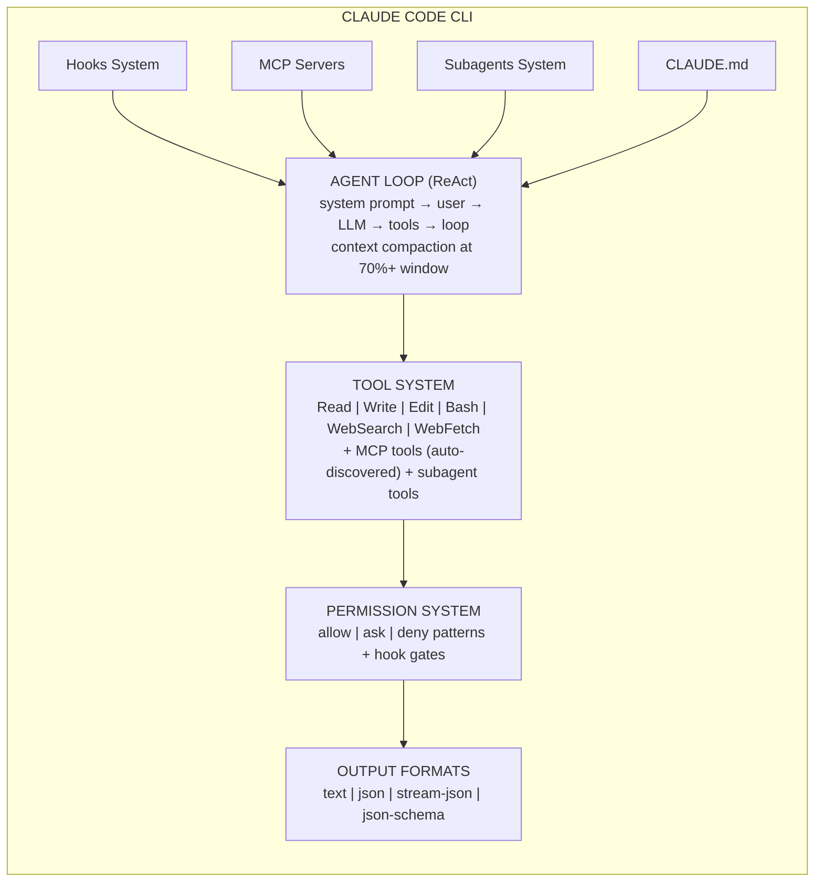
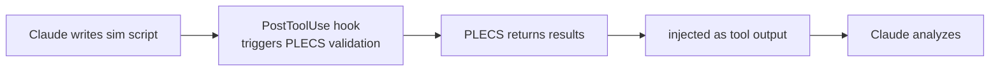
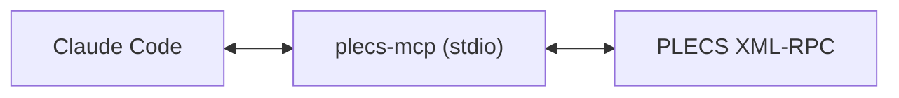

## Overview

Claude Code is Anthropic's **autonomous coding agent CLI**. It's a terminal-native application that can read, write, and edit code; execute shell commands; search the web; manage git workflows; and orchestrate subagents — all powered by Claude models.

Despite being coding-focused, Claude Code has several architectural features that make it worth studying: a sophisticated **hooks system**, **MCP integration**, **custom subagents**, and **structured output** (JSON schema). It's the most mature coding agent CLI in terms of safety tooling and structured output.

## Architecture



### Agent Loop

Standard ReAct loop with Anthropic-specific optimizations:

1. System prompt built from: built-in prompts + CLAUDE.md + rules directory + settings + MCP config
2. Context window monitoring: visual grid at `/context` command; precision degrades above 70%
3. Compaction: `/compact` command for manual, auto-triggers for safety
4. Session persistence: 5-hour session lifetime; `--continue` / `--resume` for continuation

### Tool System

**Built-in tools:** Read, Write, Edit, Bash, WebSearch, WebFetch, Task (subagents), AskUserQuestion

**Granular Bash permissions:**
```
Bash(git *)           # Only git commands
Bash(python *)        # Only python commands
Bash(pytest *)        # Only pytest commands
Bash(npm run lint:*)  # Pattern matching
```

**Permission modes:** `default`, `acceptEdits`, `plan`, `auto`, `dontAsk`, `bypassPermissions`

### Hooks System (Unique Differentiator)

8 hook types that fire on agent lifecycle events:

| Hook | Trigger | Use Case |
|------|---------|----------|
| `UserPromptSubmit` | Before processing user input | Input validation |
| `PreToolUse` | Before tool execution | Security gates, block dangerous commands |
| `PostToolUse` | After tool execution | Auto-format, lint, validate |
| `Notification` | Permission requests | Desktop alerts |
| `Stop` | Agent finishes response | Logging, status updates |
| `SubagentStop` | Subagent completes | Orchestration chaining |
| `PreCompact` | Before context compaction | Backup transcripts |
| `SessionStart` | Session begins | Load dev context |

Hooks are configured in JSON and can run arbitrary shell commands with environment variables like `CLAUDE_PROJECT_DIR`, `CLAUDE_FILE_PATHS`, `CLAUDE_TOOL_INPUT`.

### MCP Integration

- **Native MCP client** — connect to external tool servers
- **Scopes:** `user` (global), `project` (team-shared), `local` (personal)
- **Transports:** stdio, HTTP, SSE
- **Limits:** 2KB tool descriptions, configurable output caps up to 500K chars

### Subagents

Custom subagents defined in `.claude/agents/` or `~/.claude/agents/`:

```markdown
# .claude/agents/matlab-expert.md
---
name: matlab-expert
description: MATLAB/Simulink specialist for power electronics
model: opus
tools: [Read, Bash, Write]
---
You are a power electronics simulation expert. Use MATLAB Engine API...
```

Invoked with `@matlab-expert simulate the inverter topology`.

### Structured Output

- **`--output-format json`** — single JSON result with session_id, num_turns, cost, usage
- **`--output-format stream-json`** — real-time newline-delimited JSON events
- **`--json-schema`** — force output to match a JSON schema (validated before return)
- **`--replay-user-messages`** — bidirectional streaming for pipelines

### CLAUDE.md Context System

Hierarchical project context:

1. **Global:** `~/.claude/CLAUDE.md` — user preferences, always loaded
2. **Project:** `./CLAUDE.md` — team-shared, git-tracked
3. **Local:** `.claude/CLAUDE.local.md` — personal overrides, gitignored
4. **Rules directory:** `.claude/rules/*.md` — modular rules
5. **Auto-memory:** `~/.claude/projects/<project>/memory/` — learned facts (25KB cap)

## Key Features for Research Agent Use

| Feature | Relevance | Available? |
|---------|-----------|------------|
| **Hooks system** | Trigger MATLAB post-simulation validation | ✅ Excellent |
| **MCP integration** | Connect MATLAB as MCP server | ✅ Yes |
| **Subagents** | Specialist agents for simulation, review | ✅ Yes |
| **Structured output** | Parse simulation results as JSON | ✅ Yes |
| **Granular permissions** | Safe MATLAB command execution | ✅ Yes |
| **CLAUDE.md context** | Store power electronics domain knowledge | ✅ Yes |
| **Persistent memory** | Cross-session research context | ❌ No |
| **Cron scheduler** | Periodic simulation runs | ❌ No |
| **Multi-platform delivery** | Results on phone/Telegram | ❌ No |
| **Provider-agnostic** | Multiple LLM vendors | ❌ Anthropic-only |

## Strengths

1. **Best-in-class hooks system** — automate validation, formatting, security checks on every tool use
2. **Mature MCP support** — clean integration path for MATLAB as external tool server
3. **Structured output** — `--json-schema` forces valid JSON; critical for simulation result parsing
4. **Subagent orchestration** — `@specialist` pattern enables multi-agent workflows
5. **Granular permissions** — safe execution of potentially dangerous commands
6. **Rich context system** — CLAUDE.md + rules + auto-memory for domain knowledge
7. **Claude model quality** — state-of-the-art reasoning for complex analysis

## Weaknesses

1. **Proprietary license** — can't modify or redistribute; vendor lock-in risk
2. **Anthropic-only** — locked to Claude models; can't use DeepSeek, GPT, Grok
3. **Coding-focused** — not designed for general research workflows
4. **No persistent cross-session memory** — CLAUDE.md is static; auto-memory is per-project but limited
5. **No scheduling** — can't run periodic tasks without external cron
6. **Terminal-only** — no gateway for mobile notifications
7. **Cost** — Claude API pricing for long research sessions

## Suitability for Power Electronics Research

**Rating: 🟡 Moderate (strong tooling, but vendor-locked and coding-focused)**

Claude Code's **hooks system is the most interesting feature** for research automation — you could trigger MATLAB simulation validation automatically after every code change. The MCP integration provides a clean path for wrapping MATLAB as a tool.

However, the **Anthropic-only lock-in** is a major concern for research where model flexibility matters (different models for reasoning vs. code generation vs. writing). The lack of persistent cross-session memory and scheduling means you'd need to build those externally.

**Best use:** Study Claude Code's hooks architecture and MCP patterns as design inspiration. Use as a sub-component for code-heavy tasks where Claude's reasoning excels.

## Architecture Patterns Worth Adopting

### Pattern: Post-Tool Validation Hook


### Pattern: MCP PLECS Server



> **References:** [[citations]]


← [[ai-agents/harness/opencode|Prev: OpenCode CLI]] | [[ai-agents/harness/codex-cli|Next: Codex CLI]] → | [[README]]
