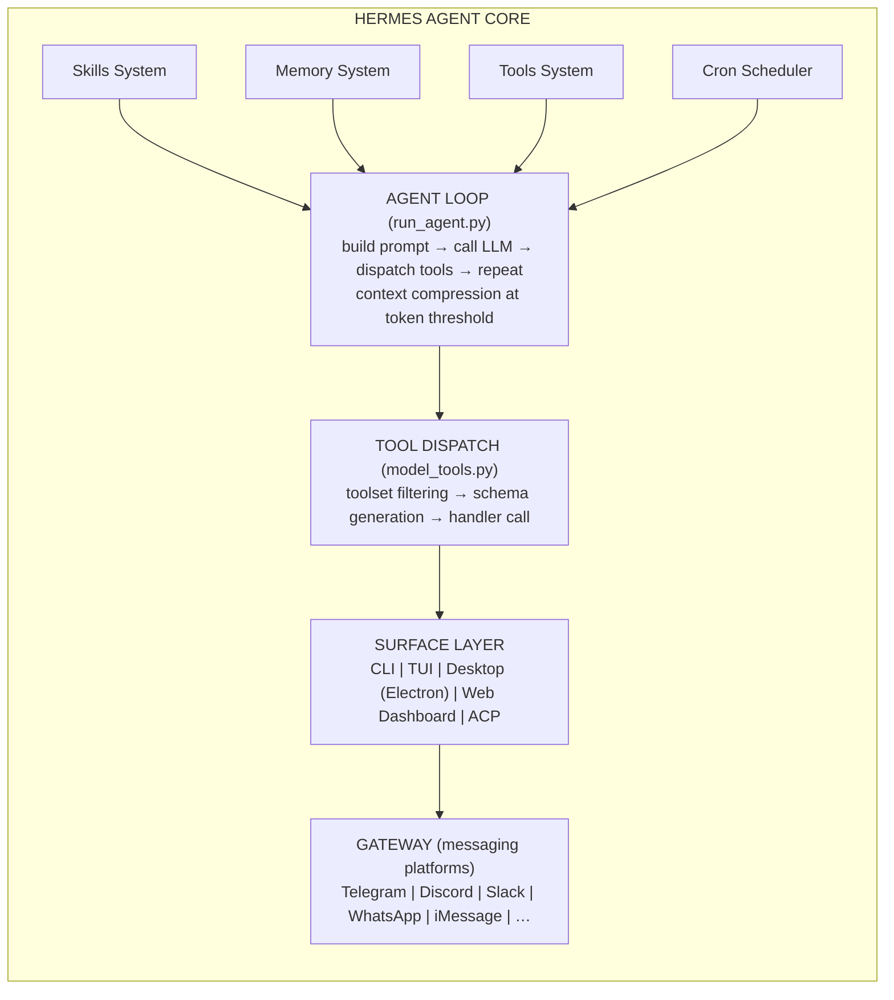
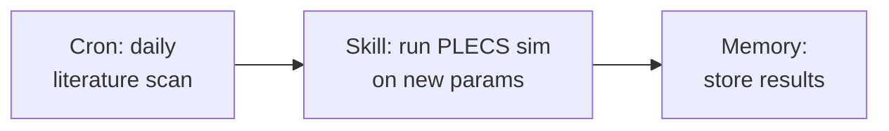
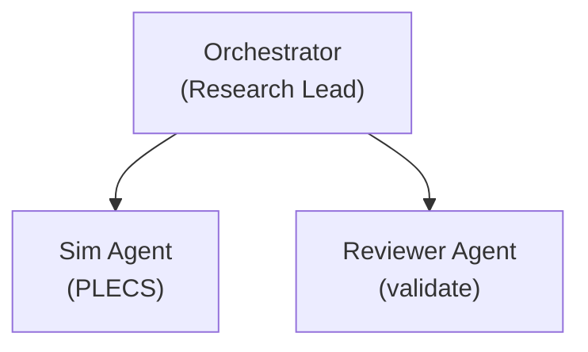

## Overview

Hermes Agent is an **open-source, provider-agnostic AI agent framework** by Nous Research — a general-purpose autonomous agent that runs across multiple surfaces (CLI, TUI, desktop GUI, messaging platforms, IDEs) with persistent memory, self-improving skills, and native multi-agent orchestration.

Unlike coding-specific agents (Claude Code, OpenCode, Codex), Hermes is a **general agent harness**: software development, research, system administration, home automation, and anything else that benefits from persistent context and full tool access.

## Architecture



### Agent Loop (`run_agent.py`)

The core conversation loop follows a standard ReAct pattern:

```
run_conversation():
  1. Build system prompt (environment hints + project context + skills + memory + SOUL.md)
  2. Loop while iterations < max_turns:
     a. Call LLM (OpenAI-format messages + tool schemas)
     b. If tool_calls → dispatch each via handle_function_call() → append results → continue
     c. If text response → return
  3. Context compression triggers automatically near token limit (configurable threshold)
```

### Tool System (`toolsets.py`, `tools/`)

- **30+ built-in toolsets:** terminal, file, web, browser, vision, code_execution, delegation, memory, session_search, cronjob, image_gen, video, and more
- **Auto-discovery:** any `tools/*.py` with `registry.register()` is auto-discovered
- **Per-platform filtering:** toolsets can be enabled/disabled per messaging platform
- **Requirement checking:** each tool has a `check_fn` that verifies dependencies before appearing
- **Custom tools:** plugins in `~/.hermes/plugins/` can add tools without modifying core
- **MCP support:** native MCP client connects stdio/HTTP servers, auto-discovers their tools

### Skills System

**Key differentiator** — Hermes learns from experience:

- **Self-improving:** persists knowledge as a skill when it solves a complex problem or discovers a workflow
- **Auto-loading:** skills matching the current task are injected into the system prompt
- **Curator:** background process tracks skill usage, marks idle skills stale, archives them
- **Hub integration:** `hermes skills install <id>` from community registry
- **Zero-cost curation:** deterministic inactivity sweep runs free; optional LLM consolidation pass is opt-in

Skills make Hermes *better over time* at specific tasks and environments.

### Memory System

- **Persistent cross-session memory** — facts survive across sessions
- **User profile** — remembers preferences, environment details, conventions
- **Pluggable backends:** built-in, Honcho, Mem0, and more
- **Batch operations:** atomic add/replace/remove against character budget
- **Source-targeted:** separate `user` (who they are) from `memory` (environment facts)

### Delegation (`delegate_task`)

Native subagent spawning:

- **Single or batch** — up to 3 concurrent children
- **Leaf vs. orchestrator roles** — orchestrators can spawn their own workers (depth-limited)
- **Background mode** — child runs in background, result re-enters parent conversation when done
- **Isolated context + terminal** — each child gets its own session
- **Configurable:** per-subagent model/provider override, toolset restrictions

### Cron Scheduler

Durable scheduled jobs:

- **Schedule types:** duration ("30m"), "every" phrases, 5-field cron, ISO timestamps
- **Per-job knobs:** skills, model/provider override, script pre-run, context chaining
- **Multi-platform delivery:** fan-out to Telegram, Discord, Slack, etc.
- **Safety:** 3-minute hard interrupt, tick-lock prevents duplicate runs

### Gateway (Multi-Platform)

20+ messaging platforms with full tool access (not just chat):
Telegram, Discord, Slack, WhatsApp, iMessage, Signal, Email, SMS, Matrix, Teams, and more.

### Surfaces

Same agent core drives: CLI, Ink TUI, Electron desktop app, web dashboard, ACP server (IDE integration).

## Key Features for Research Agent Use

| Feature | Relevance for Power Electronics Research |
|---------|----------------------------------------|
| **Skills system** | Encode power electronics domain knowledge, MATLAB/Simulink workflows, SPICE analysis procedures as reusable skills |
| **Memory** | Persist simulation results, component libraries, research findings across sessions |
| **Cron scheduler** | Schedule periodic simulation runs, literature scans, data collection |
| **Delegation** | Spawn researcher agent + simulator agent + reviewer agent in parallel |
| **Tool extensibility** | Wrap MATLAB Engine API, Simulink, PLECS, LTSpice as custom tools |
| **Provider-agnostic** | Use DeepSeek for reasoning, Claude for code, GPT for writing — swap per task |
| **Gateway** | Receive simulation results via Telegram, trigger runs from phone |
| **Profiles** | Isolate different research projects with separate configs and skills |
| **MCP support** | Connect to MATLAB via MCP server, access paper databases |

## Strengths

1. **Most complete agent harness** — skills + memory + cron + delegation + gateway in one framework
2. **Self-improving** — gets better at power electronics tasks over time via skills accumulation
3. **MIT licensed** — no restrictions on commercial or research use
4. **Provider flexibility** — not locked to any single LLM vendor
5. **Multi-surface** — works from terminal, desktop, phone, or IDE
6. **Active development** — frequent updates, large community

## Weaknesses

1. **Complexity** — more moving parts than simpler agents; steeper learning curve
2. **General-purpose** — not optimized for any specific domain; requires tuning for research tasks
3. **Python-only** — extensions require Python (MATLAB Engine API for Python works but adds dependency)
4. **No native MATLAB integration** — must build custom tools
5. **Young ecosystem** — skills hub and plugin ecosystem still growing

## Architecture Patterns Relevant to Our Project

### Pattern 1: Research Pipeline via Cron + Skills


### Pattern 2: Multi-Agent Research via Delegation



> **References:** [[citations]]


← [[README|Back to Index]] | [[opencode|Next: OpenCode CLI]] →
