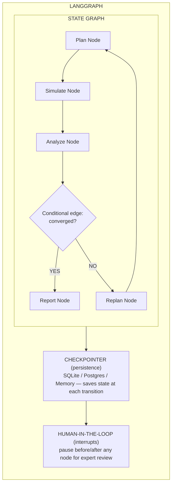

## Overview

LangGraph is a **state machine-based agent framework** built on LangChain. It models agent workflows as directed graphs where nodes are computation steps (LLM calls, tool executions, human inputs) and edges are conditional transitions. Unlike DAG-only frameworks, LangGraph supports **cycles**, enabling true iterative agent loops.

For power electronics research, this is the **most natural architecture**: the research cycle (plan → simulate → analyze → replan) maps directly to a cyclic graph with checkpointing at each stage.

## Architecture



### Core Concepts

| Concept | Description | Research Use |
|---------|-------------|-------------|
| **State** | Typed, persistent data passed between nodes | Simulation parameters, results, iteration history |
| **Nodes** | Python functions or LangChain runnables | LLM reasoning, MATLAB call, data analysis |
| **Edges** | Transitions: fixed (always go to X) or conditional (if X then Y else Z) | "If efficiency < 95%, replan topology" |
| **Checkpointer** | Persistence layer saving state at each step | Resume from failed simulation at exact step |
| **Interrupt** | Pause execution for human approval | Review MATLAB model before running 8-hour sim |
| **Subgraphs** | Nested graphs for multi-agent composition | Literature agent graph inside research graph |
| **Streaming** | Token-by-token or node-by-node output | Live simulation progress to user |

### Example: Power Electronics Research Graph

```python
from langgraph.graph import StateGraph, END
from typing import TypedDict

class ResearchState(TypedDict):
    topology: str
    parameters: dict
    simulation_results: dict
    efficiency: float
    iteration: int
    converged: bool

def plan_topology(state: ResearchState) -> ResearchState:
    """LLM reasons about topology selection."""
    # LLM call: given requirements, what topology?
    return {"topology": "3-level NPC", "parameters": {...}}

def run_matlab_simulation(state: ResearchState) -> ResearchState:
    """Call MATLAB Engine API via tool."""
    import matlab.engine
    eng = matlab.engine.start_matlab()
    result = eng.simulate(state["topology"], state["parameters"])
    return {"simulation_results": result, "efficiency": result["eff"]}

def analyze_results(state: ResearchState) -> ResearchState:
    """LLM analyzes simulation output."""
    converged = state["efficiency"] > 95.0
    return {"converged": converged, "iteration": state["iteration"] + 1}

def should_continue(state: ResearchState) -> str:
    if state["converged"] or state["iteration"] >= 10:
        return "report"
    return "replan"

# Build graph
workflow = StateGraph(ResearchState)
workflow.add_node("plan", plan_topology)
workflow.add_node("simulate", run_matlab_simulation)
workflow.add_node("analyze", analyze_results)
workflow.add_node("replan", plan_topology)  # Reuse LLM node
workflow.add_node("report", generate_report)

workflow.set_entry_point("plan")
workflow.add_edge("plan", "simulate")
workflow.add_edge("simulate", "analyze")
workflow.add_conditional_edges("analyze", should_continue, {
    "report": "report",
    "replan": "replan"
})
workflow.add_edge("replan", "simulate")
workflow.add_edge("report", END)

# Compile with checkpointing for fault tolerance
app = workflow.compile(checkpointer=SqliteSaver.from_conn_string("research.db"))
```

## Key Features for Research Agent

| Feature | Research Benefit |
|---------|-----------------|
| **Cyclic graphs** | Natural fit for iterative research: plan→sim→analyze→replan |
| **Checkpointing** | Resume 8-hour simulation from exact failure point, not restart |
| **Human-in-the-loop** | Expert reviews MATLAB model before committing to long simulation |
| **Subgraphs** | Embed PaperQA2 literature review as subgraph within research graph |
| **Streaming** | Real-time simulation progress: "Running parameter sweep 47/100..." |
| **Conditional edges** | Branch on results: "If THD < 5%, proceed; else try new modulation" |
| **State persistence** | Survive process restarts; long-running research across days |
| **Multi-agent** | Each subgraph can be its own specialist agent |

## Strengths

1. **Architecture matches research workflows** — iterative, conditional, stateful
2. **Fault-tolerant** — checkpointing means failed simulations don't lose progress
3. **Human review** — experts can validate before expensive simulations run
4. **MIT licensed** — no restrictions
5. **LangChain ecosystem** — access to 100+ LLM providers, 50+ vector stores, RAG
6. **Python-native** — easy MATLAB Engine API integration
7. **Streaming** — research progress visible in real-time

## Weaknesses

1. **Library, not platform** — no CLI, no cron, no gateway, no memory out of the box
2. **LangChain dependency** — inherits LangChain's complexity and abstraction layers
3. **No built-in tool management** — tools are just Python functions; no registry/discovery
4. **Learning curve** — graph-based thinking requires mental model shift
5. **Operational gap** — you build scheduling, delivery, persistence yourself

## MATLAB Integration Potential: 🟢 Very High

LangGraph is likely the **best library foundation** for a power electronics research agent:

- Each MATLAB simulation is a graph node — parameters in, results out
- Conditional edges handle simulation failures gracefully
- Checkpointing enables multi-hour parameter sweeps without restart risk
- Human-in-the-loop: "Review this MOSFET selection before running thermal sim"
- Subgraphs enable parallel simulation nodes for parameter sweeps
- Streams simulation progress back to the user

## Suitability: 🟢 Excellent (as workflow engine)

**Role:** The "research brain" — orchestrates the iterative research cycle.  
**Pair with:** Hermes Agent for operational concerns (memory, scheduling, delivery).


> **References:** [[citations]]


← [[README]] | [[crewai|Next: CrewAI]] →
