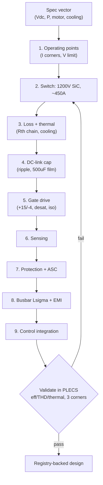

## What This Note Is

The **end-to-end sizing method** for a 2L-B6 SiC traction inverter: from a spec vector to switch, thermal, DC-link, gate-drive, sensing, protection, and busbar numbers. Each step gives the governing relation, its citation, and a **worked value** at the reference-design anchor. It is the math behind [[reference-design-2l-b6-sic-800v]]; the diagrams are in [[schematics]]; the parts are in [[bom]].

**Citation convention:** `[NN]` → [[citations]]; `[T]` → training knowledge (unverified vs a primary source); **[derived]** → computed here from cited relations. Every number carries one marker. Formula results are **hand estimates to be replaced by PLECS** — the handoff mandates that efficiency/THD/thermal numbers come from a validated PLECS model, not from these closed-form checks [80].

---

## 0. Design Inputs (the spec vector)

The anchor spec. Motor parameters are typical-IPMSM placeholders `[T]` (from the ranges in [[control-how-to]] §2, textbook [30][50]) until a real datasheet replaces them.

| Input | Symbol | Value | Basis |
|-------|--------|-------|-------|
| DC-link nominal | Vdc,nom | 750 V | 800V-class pack, mid-SOC [T] |
| DC-link range | Vdc,min–max | 550–850 V | pack empty→full [T] |
| Transient bus clamp | Vdc,clamp | 900 V | regen OVP set-point [T] |
| Peak power (≤30 s) | Ppk | 150 kW | anchor spec |
| Continuous power | Pcont | 70 kW | anchor spec |
| Max phase current | Is,max | 300 A rms | IPMSM launch limit [T] |
| Power factor at peak | cosφ | 0.85–0.95 | IPMSM at MTPA [30][50] |
| Switching frequency | fsw | 16 kHz | SiC 2L range 10–40 kHz [50], [[circuit-topologies]] §1 |
| Coolant inlet | Tcool | 65 °C | water-glycol loop [T] |
| Pole pairs | Pp | 4 | 8-pole IPMSM [T] |
| Rs / Ld / Lq / λPM | — | 12 mΩ / 0.2 mH / 0.4 mH / 0.09 Wb | typical 150 kW IPMSM [T][47][50] |

---

## 1. Operating-Point Analysis

**Max linear line-line RMS voltage** (SVPWM, linear region) [50], [[control-schemes]] §4.2:
`V_LL,rms(max) = Vdc/√2`. At Vdc,nom=750 V → **530 V** [derived]. Overmodulation to six-step raises the fundamental to `≈0.78·Vdc ≈ 585 V` at the cost of THD [50].

**Two current-defining corners** — size for the worse of:
- **High-speed peak power:** `I_ph,rms = Ppk / (√3·V_LL,rms·cosφ)` [50]. With V_LL≈500 V (headroom for control), cosφ=0.9 → `150000/(1.732·500·0.9)` = **≈192 A rms** [derived].
- **Low-speed launch (torque-limited):** `I_ph,rms = Is,max = 300 A rms` → peak instantaneous `300·√2 = 424 A` [derived].

**The current rating driver is the launch corner (424 A peak), not peak power** — a classic sizing trap [30]. Size the module to the 300 A rms / 424 A peak duty, thermally limited by its allowable time-at-current.

---

## 2. Switch Selection

**Voltage rating.** Peak device stress = worst-case bus + turn-off overshoot:
`Vds,pk = Vdc,max + Lσ·(di/dt)` [50], with `Lσ` the commutation-loop inductance (§8). For Lσ=15 nH and di/dt≈10 A/ns → overshoot ≈150 V [derived]; `Vds,pk ≈ 850+150 = 1000 V`. A **1200 V SiC MOSFET** runs at `1000/1200 = 83%` worst-case, `850/1200 = 71%` nominal — inside the ≤80% nominal derating rule and leaving cosmic-ray margin [T][25][89]. 650 V/900 V devices are ruled out; this is why 800V systems force 1200 V SiC [28], [[circuit-topologies]] §4.

**Current rating / paralleling.** Choose a module whose continuous rating meets the launch duty with thermal margin — **~450 A / 1200 V class** (e.g., [38][39]-type). SiC's positive Rds(on) tempco eases die paralleling inside the module [24], [[components]] §1.2. Qualify to automotive stress standards **AQG 324 / AEC-Q101** [88][89].

---

## 3. Loss & Thermal Design

Loss model per Ma et al. [25]; PE fundamentals [50]. **These closed forms are order-of-magnitude checks; PLECS replaces them** [80].

**Conduction (per switch):** `P_cond = I_sw,rms²·Rds(on,Tj)`. Device RMS current ≈ `I_ph,rms/√2` at high modulation [50]. At peak-power I_ph,rms=192 A → I_sw,rms≈136 A; with hot Rds(on)=5 mΩ → `136²·0.005` = **≈92 W/switch** [derived].

**Switching (per switch):** `P_sw = fsw·(Eon+Eoff)|Vdc,I`. 1200 V SiC module Eon+Eoff ≈ 3–6 mJ at 750 V/200 A [T, datasheet-class [38][39]]. Using 4 mJ → `16e3·4e-3` = **64 W/switch** [derived].

**Total semiconductor loss:** `6·(92+64) ≈ 0.94 kW` + dead-time body-diode conduction ~0.1 kW [T] → `≈1.0 kW` at 150 kW ⇒ **η_inv ≈ 99.3% at peak** [derived]. Cross-checks against the SiC 2L "98–99% peak" range in [[traction-inverter-index]] and [28] — consistent, and a reminder that **partial-load, not peak, is where topology choice pays** [28][43].

**Thermal chain:** `Tj = Tcool + P_loss·(Rth,jc + Rth,ch + Rth,cooler)` [25]. With Rth,jc≈0.15 K/W and Rth,ch+cooler≈0.15 K/W [T], and 156 W/switch → ΔTj ≈ `156·0.30` = 47 K ⇒ `Tj ≈ 65+47 = 112 °C` at peak, under SiC Tj,max 175 °C [derived]. The **continuous** limit is set by holding Is,max: that is a transient-thermal (Zth) problem, sized in PLECS, not here. Cooling class: pin-fin water-glycol, 10–20 kW/L [[components]] §6.1.

---

## 4. DC-Link Capacitor Sizing

Driver is **ripple-current rating and ESL**, not capacitance [41][84].

**RMS ripple current** (Kolar & Round closed form) [84]:
`I_cap,rms = I_ph,rms·√(2m·(√3/(4π) + cos²φ·(√3/π − 9m/16)))`, worst case ≈ `0.6·I_ph,rms` near m≈0.6 [84]. At peak power (192 A) → **≈115 A rms**; at launch (300 A) transiently up to **≈180 A rms** [derived]. The bank must carry ~120 A rms continuously.

**Capacitance** for a switching-ripple bus deviation ΔVdc ≤ 1–2% [T]: for 100–200 kW SiC inverters this lands at **300–600 µF** [[components]] §3.1, [41]; pick **500 µF**.

**Technology / rating:** metallized-polypropylene **film**, self-healing, ESR < 1 mΩ, low ESL [41][90]; voltage rating ≥ Vdc,clamp + margin → **≥900 Vdc rated** for the 850 V bus [T][41]. Electrolytic is excluded (ESR, dry-out) [[components]] §3.1.

---

## 5. Gate-Driver Design

Requirements table and part-classes in [[components]] §2; IC application basis [40].

- **Drive rails:** +15 V / −4 V for 1200 V SiC — negative off-bias prevents Miller-induced parasitic turn-on given SiC's low Vth [40], [[components]] §2.3.
- **Gate resistor:** `Rg` trades switching loss vs di/dt-driven overshoot; peak gate current `Ig,pk = (Vdrive,on − Vdrive,off)/(Rg+Rg,int)` sized to the module's Qg [40]. Target ±10 A class output stage [40].
- **Protection:** desat detection **<1.5 µs** (SiC short-circuit withstand only 3–5 µs) [40], [[components]] §1.2; active Miller clamp; UVLO on both rails; soft turn-off on fault to bound `Lσ·di/dt` overshoot [40].
- **Isolation:** reinforced ≥5 kV, per drive-system safety [86][40]; isolated DC-DC bias per channel [40].

---

## 6. Sensing Design

- **Phase current:** BW ≥ 50 kHz, isolated, ±1–2% over temperature — Hall module or shunt + isolated ADC [42], [[components]] §4. Two sensors suffice (`ΣI=0`); three add ASIL redundancy [85].
- **DC-link voltage:** isolated divider / iso-amp into MCU ADC, for OVP and field-weakening headroom [50].
- **Junction temperature:** module NTC feeding an online thermal model (NTC lags true Tj) [25].
- **Rotor position:** resolver, ±0.1°, with a sensorless observer as a divergence check for ASIL-D [ [[control-schemes]] §5, [48] ].

---

## 7. Protection & Functional Safety

Governed by ISO 26262; unintended-torque and position-loss are ASIL-C/D [85], [[control-schemes]] §6.3.

| Fault | Detection | Reaction | Cite |
|-------|-----------|----------|------|
| Short-circuit / shoot-through | desat < 1.5 µs | soft turn-off, latch | [40] |
| Overcurrent (phase) | fast comparator on sense | disable PWM | [85][50] |
| DC-link overvoltage (regen) | Vdc sense | stop regen; ASC if needed | [85] |
| Over-temperature | Tj model / NTC | linear current derate | [25][85] |
| Resolver / torque-mismatch | observer vs sensor, torque monitor | **ASC** (all low-side ON) within ~100 ms | [55][85] |
| Loss of gate power | UVLO | freewheel → ASC if speed high | [55] |

**ASC vs freewheel:** ASC shorts the machine (braking current circulates, ~0.1–0.3 pu drag); freewheel lets back-EMF pump the bus through body diodes and can overvolt at speed — so ASC is the high-speed safe state [55], [[pimpale-mahadik-2025-asc-discharge]]. Bus **safe-discharge to <60 V** on shutdown is a separate service-safety duty [55][85].

---

## 8. Busbar / Commutation Loop & EMI

- **Stray inductance target `Lσ < 10–15 nH`** for SiC: overshoot `V = Lσ·di/dt`, ringing `f = 1/(2π√(Lσ·Coss))` [25][50], [[components]] §5. Achieved with a **laminated busbar** (wide thin planes, thin dielectric) and cap-to-module proximity [41].
- **dv/dt management:** SiC edges 15–50 kV/µs stress motor insulation and drive bearing currents — motor must be inverter-duty rated **IEC 60034-18-41** [87]; mitigations (dv/dt filter, CM choke, shaft grounding) per [54], [[circuit-topologies]] §1.
- **EMI:** conducted/radiated emissions to **CISPR 25** [56]; Y-caps and common-mode choke on the DC input [54][56].

---

## 9. Control Integration

fsw=16 kHz → PWM period 62.5 µs; current loop **double-update** at 31.25 µs; current-loop bandwidth ~1–2 kHz (10–20× below update rate) [50][47], [[control-schemes]] §7.2. PI gains from IMC (`Kp=ωc·L`, `Ki=ωc·Rs`), MTPA + field-weakening LUTs — full recipe in [[control-how-to]].

---

## 10. Design Flow Summary

The loop closes on **PLECS validation at ≥3 corners** (low-line / nominal / high-line, + thermal) — the handoff's definition of "PLECS-backed evidence" [80][58].

---

## Red Team

**Steelman against:** This procedure produces plausible first-pass numbers, but almost every quantitative result is a closed-form estimate resting on `[T]` motor parameters and datasheet-class device figures — not measurement, not PLECS. A reader could treat "η ≈ 99.3%" or "Tj ≈ 112 °C" as facts; they are algebra on assumptions.

**How it could be false:**
1. **Loss model is first-order.** [25]-style analytic loss ignores current-dependent Eon/Eoff nonlinearity, dead-time/reverse-recovery detail, and thermal coupling between dice — real losses can differ 20–40% [25].
2. **Motor parameters are placeholders `[T]`.** Ld/Lq/λPM drive the current and power-factor corners; ±20–30% saturation/temperature swings move I_ph and thus every downstream size [[control-how-to]] §8.
3. **Ripple-current worst case** from [84] assumes ideal sinusoidal currents and a specific m; real drive-cycle ripple with dead-time distortion and FW operation differs.
4. **The Lσ<15 nH budget is a layout claim**, unverifiable from a sizing note — turn-off overshoot must be measured/simulated.
5. **Standards cited by designation** [85][86][87][88][89] — the texts are paywalled and were not read in full; requirements are paraphrased from public summaries and could be imprecise.

**What would change my mind:** A validated PLECS 2L-B6 model reproducing efficiency, THD, and Tj within these estimates at the three corners; a real IPMSM datasheet replacing the `[T]` parameters; a measured turn-off overshoot confirming the Lσ budget.

**Residual doubt:** This is a competent design *scaffold* and RAG substrate. It is not a validated design. Its whole purpose is to be the input to the PLECS loop that produces the real numbers [80].

---

> **References:** [[citations]]

← [[schematics]] | [[reference-design-2l-b6-sic-800v]] | [[bom]] →
