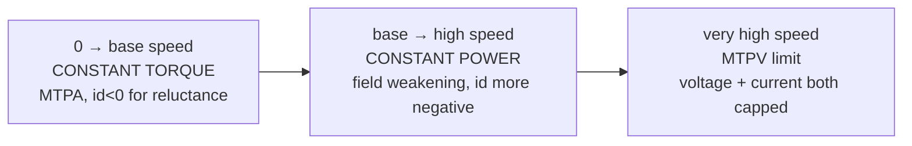

## What This Note Is

The inverter drives a motor; the motor is the **plant** the control loop closes around. Every FOC gain, MTPA table, and field-weakening limit is a function of machine parameters. This note documents that plant so the RAG base covers *how the control is made*, not just the power stage. Parameters feed [[control-how-to]]; the dq model here is the one [[control-schemes]] assumes.

**Citation convention:** `[NN]` → [[citations]]; `[T]` → training knowledge; **[derived]** → shown from cited relations.

---

## 1. Machine Types Used in Traction

| Machine | Where used | Why / trade-off | Cite |
|---------|-----------|-----------------|------|
| **IPMSM** (interior PM) | Dominant — Tesla (front), most BEVs | High torque density + reluctance torque + wide field-weakening range | [30][47][50] |
| SPMSM (surface PM) | Some, lower power | Simpler rotor, no saliency → less field-weakening range | [47][50] |
| Induction (IM) | Tesla Model S/X (rear), some | No magnets (cost/supply), rugged; lower part-load efficiency | [30][21] |
| EESM / WRSM (wound rotor) | Renault, BMW i-series | No rare-earth magnets; rotor excitation is a control DOF; needs rotor power transfer | [T][30] |
| SynRM / PMa-SynRM | Emerging | Reluctance-dominant, reduced magnet content | [T][30] |

**IPMSM dominates** because reluctance torque (from `Ld ≠ Lq`) adds to magnet torque and the saliency enables a wide constant-power region — exactly what a car needs [30][47][50], [[circuit-topologies]] context.

---

## 2. Construction (what sets the parameters)

- **Stator:** three-phase distributed or hairpin windings in a laminated core. Hairpin windings dominate modern traction (high slot fill → lower Rs, better thermal) [T][30].
- **Rotor:** buried (interior) magnets in a laminated core; magnet geometry (V-shape, delta) sets saliency `Lq/Ld` [T][47].
- **Pole pairs `Pp`:** typically 4 (8-pole). Sets electrical/mechanical frequency ratio: `ωe = Pp·ωm` [50].
- **Cooling:** stator jacket (water-glycol) and/or rotor shaft oil; magnet temperature is a hard limit (§6) [T].

---

## 3. Parameters the Inverter/Control Depend On

Ranges for a ~150 kW IPMSM (mirror of [[control-how-to]] §2, textbook basis [47][50]):

| Parameter | Symbol | Typical | Role in control |
|-----------|--------|---------|-----------------|
| Stator resistance | Rs | 5–30 mΩ | sets `Ki = ωc·Rs`; conduction loss | 
| d-axis inductance | Ld | 0.1–0.5 mH | sets `Kp_d = ωc·Ld`; field weakening |
| q-axis inductance | Lq | 0.2–1.0 mH | sets `Kp_q`; reluctance torque |
| PM flux linkage | λPM | 0.05–0.15 Wb | magnet torque; back-EMF |
| Pole pairs | Pp | 4–8 | ωe↔ωm, torque scaling |
| Saliency ratio | Lq/Ld | 1.5–3 | reluctance torque, sensorless HF injection |
| Max current | Is,max | 300–500 A rms | thermal/demag limit |

Basis: [47][50][45], [[control-how-to]] §2. All `[T]`-class until a real datasheet replaces them — this is the placeholder set the design procedure warns about ([[design-procedure]] §0).

---

## 4. The dq Plant Model (what FOC assumes)

Electrical dynamics in the rotor (dq) frame [47][50], [[control-schemes]] §2.2:

```
vd = Rs·id + Ld·(did/dt) − ωe·Lq·iq
vq = Rs·iq + Lq·(diq/dt) + ωe·(Ld·id + λPM)
```

**Electromagnetic torque** (magnet + reluctance terms) [47][50]:

```
Te = (3/2)·Pp·[ λPM·iq + (Ld − Lq)·id·iq ]
        \____magnet____/   \___reluctance___/
```

For IPMSM `Ld < Lq`, so a *negative* id adds positive reluctance torque — this is why MTPA runs id<0 even before field weakening [45][50], [[control-schemes]] §2.3.

**Back-EMF** rises with speed: `e ≈ ωe·λPM`. When it approaches the inverter voltage ceiling `Vdc/√3` (linear SVPWM), the machine enters field weakening [50], §2.4.

---

## 5. Operating Regions



- **Constant-torque (below base speed):** full torque available; current-limited; run MTPA [45][50].
- **Constant-power (above base speed):** back-EMF hits voltage limit; inject negative id to weaken flux; torque falls as ~1/ω [50], §2.4.
- **MTPV (deep field weakening):** both voltage and current saturated; id approaches characteristic current `λPM/Ld` [50].

---

## 6. Machine Losses & Limits (system efficiency + safety)

- **Copper (I²Rs):** dominant at low speed/high torque [50].
- **Iron (hysteresis + eddy):** rise with frequency/flux; significant at high speed [30].
- **Magnet eddy-current loss:** heats magnets — couples to demagnetization risk [T].
- **Mechanical (bearing, windage):** small [T].

**Hard limits the inverter must respect:**
- **Irreversible demagnetization:** high temperature + large negative id can permanently weaken magnets → the current/temperature envelope is a safety limit, not just efficiency [T][47].
- **Winding insulation vs inverter dv/dt:** SiC edges stress insulation → machine must be inverter-duty rated **IEC 60034-18-41** [87], [[design-procedure]] §8.
- **Bearing currents:** common-mode dv/dt drives EDM pitting; mitigate with shaft grounding / ceramic bearings [54], [[circuit-topologies]] §1.

---

## 7. Interfaces to the Inverter

- **Position feedback:** resolver / inductive encoder → FOC angle θ; ASIL-D needs guaranteed position [48], [[control-schemes]] §5.
- **Phase currents:** measured at the inverter, referenced to PWM center → Clarke/Park → id,iq [50], [[schematics]] §6.
- **Temperature:** winding thermistor + magnet-temp estimation feed derating [T], §6.

---

## 8. For Simulation (PLECS)

PLECS ships **native PMSM (with saturation lookup) and induction-machine models plus an FOC traction demo** — use these as the load rather than modeling the machine from scratch [80]. Saturation and cross-coupling (Ld, Lq varying with id, iq) are exactly what the linear model in §4 omits and what the LUT captures [80][45].

---

## Red Team

**Steelman against:** The linear dq model here is the textbook plant, but a real traction IPMSM is strongly nonlinear — Ld, Lq, and λPM all vary with current (saturation) and temperature. Control tuned on the constant-parameter model works but leaves torque accuracy and efficiency on the table exactly where it matters (high current, low speed). Treating §4 as "the machine" is the same simplification that makes closed-form design numbers provisional.

**How it could be false:**
1. **Saturation/cross-coupling ignored:** Ld(id,iq), Lq(id,iq) swing 20–40% under load; the constant-L torque equation misstates torque and MTPA angle [45].
2. **Parameters are proprietary/`[T]`:** OEM machine data is not public; the ranges here are textbook, not a specific motor.
3. **Machine-type shares are `[T]`:** "IPMSM dominant" is industry consensus, not a cited market survey; EESM adoption (Renault/BMW) is growing and could shift the picture [30].
4. **Loss/demag limits unquantified:** the demagnetization envelope is machine-specific and needs FEA or datasheet data absent here.

**What would change my mind:** A real machine datasheet or FEA-extracted flux maps (id,iq → λd, λq) replacing §3–§4; a PLECS saturation-LUT model reproducing torque within a few % across the operating map.

**Residual doubt:** Correct as the plant *model* FOC is built on, and sufficient to stand up simulation. The gap between this linear plant and a saturating, heating real machine is where production calibration spends its effort — flagged, not closed.

---

> **References:** [[citations]]

← [[control-schemes]] | [[control-how-to]] | [[reference-design-2l-b6-sic-800v]] →
