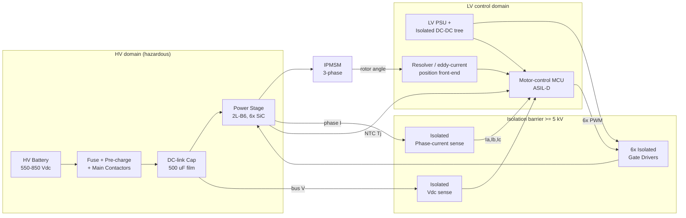
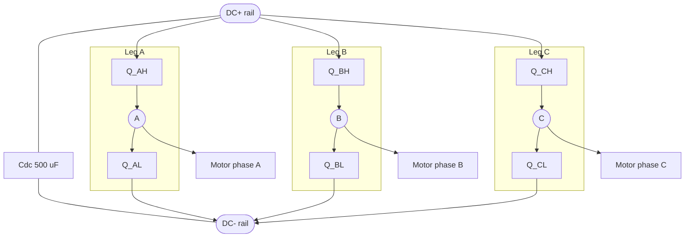
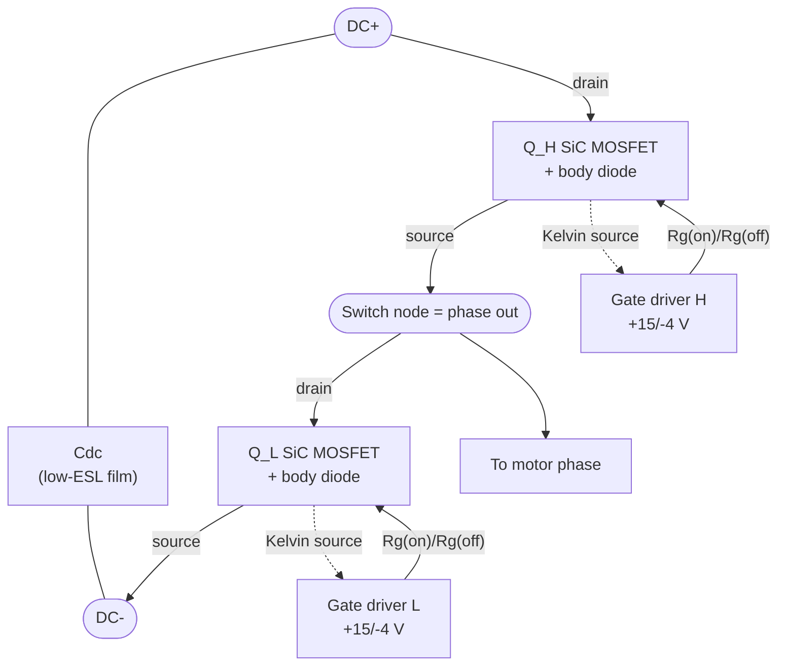
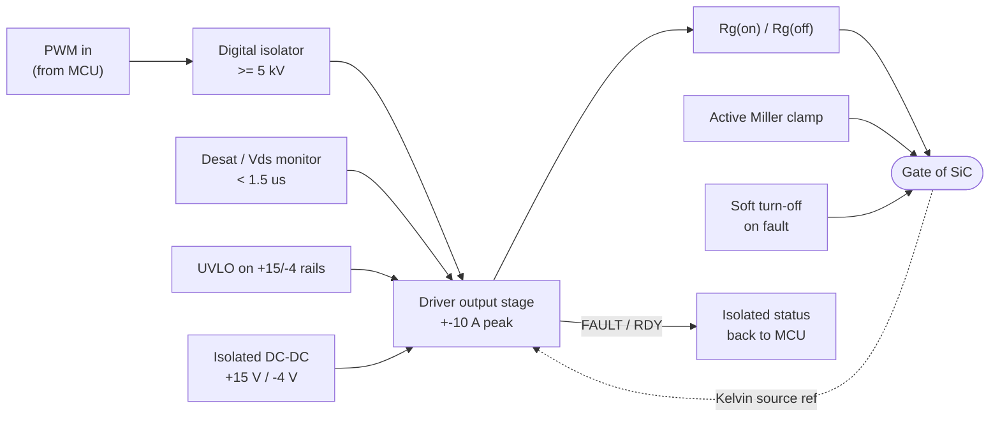
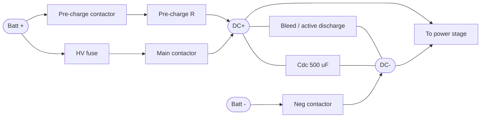
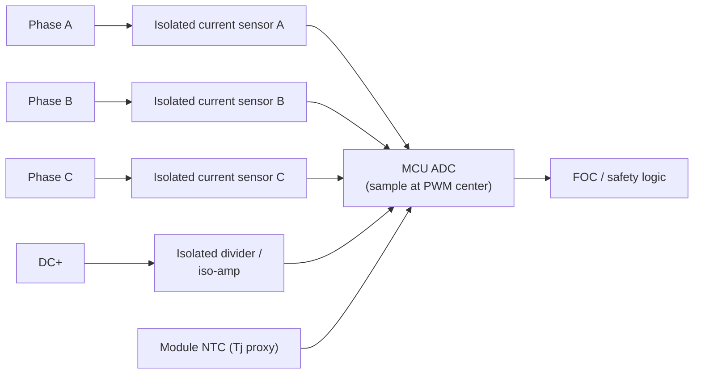
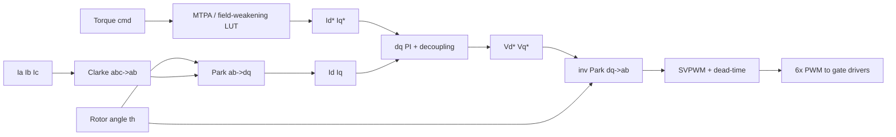
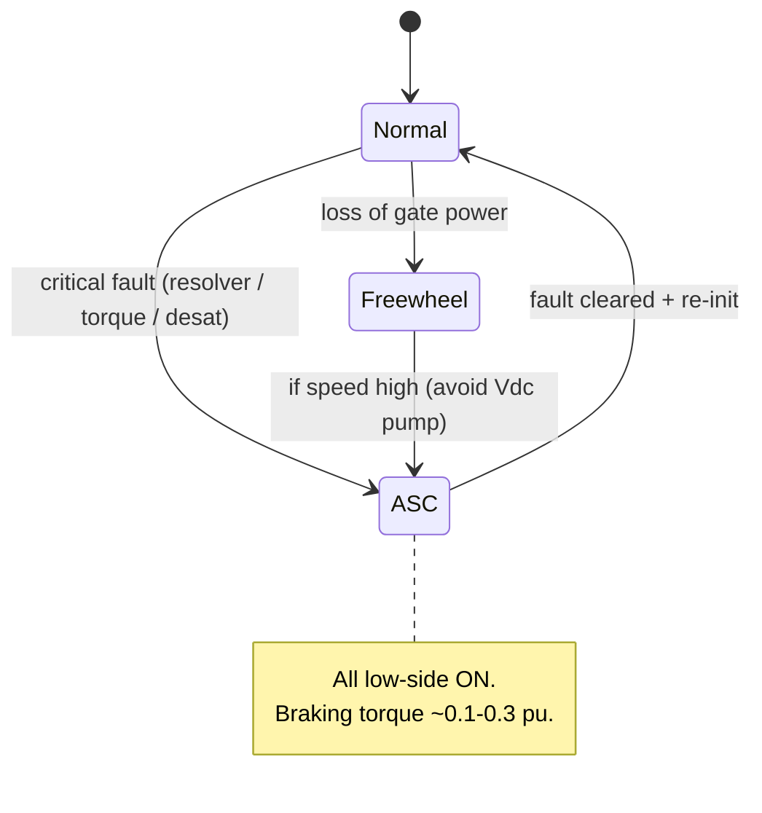

## What This Note Is

Connectivity/block **schematics** for a 2L-B6 SiC traction inverter, drawn in Mermaid so they render in Obsidian and stay diff-able for RAG. They anchor the reference design in [[design-2l-b6-800v-sic]] and the sizing math in [[design-procedure]].

**Scope limit:** Mermaid is a graph/flow renderer, not a schematic-capture tool. These diagrams show **what connects to what and the signal/power flow** — not exact analog symbols, net names, or component footprints. The transistor-level switching arrangement (anti-parallel body diode, complementary switch pairs, switching states) is in [[circuit-topologies]] as ASCII circuits. For a real board you capture these in KiCad/Altium and datasheet-check the connections (cf. [[drcy-2026-allspice-mas-review]] [68]); these are the intent, not the netlist.

**Citation convention (this note and the whole design cluster):** `[NN]` → numbered entry in [[citations]]; `[T]` → training knowledge, not verified against a primary source; **derived values** (currents, capacitance, loss, Lσ budget) are computed in [[design-procedure]] and cited there — the diagram labels reproduce those results, so read the referenced §. No value here is meant to stand without one of these markers.

---

## 1. System-Level Power + Signal Flow

The three domains: **HV power path** (battery → DC-link → power stage → motor), **isolation barrier**, and **LV control/sense path**.

---

## 2. Power Stage — 2L-B6 Bridge

Three identical half-bridge legs across a stiff DC bus. Each switch `Q` is a SiC MOSFET (with intrinsic body diode used for third-quadrant/freewheel conduction). High-side and low-side of a leg are **complementary + dead-time interlocked** — they must never conduct together (shoot-through).

---

## 3. Half-Bridge Leg — Device Detail

One leg, showing the commutation loop and the two gate-drive interfaces. The **Kelvin-source** connection (separate from the power-source) is mandatory for SiC: it keeps power-loop di/dt out of the gate loop, or switching speed collapses.

The **commutation loop** is `DC+ → Q_H → Q_L → DC- → Cdc → DC+`. Its stray inductance `Lσ` sets turn-off overshoot (`V = Lσ·di/dt`) and ringing — target `Lσ < 10–15 nH` for SiC [derived in [[design-procedure]] §8; loss/thermal basis [25], general PE [50]]. The Kelvin-source requirement for fast SiC switching is a gate-driver design rule [40][50].

---

## 4. Gate-Driver Channel (per switch, ×6)

Every switch gets an isolated channel with local protection. This is the single most safety-critical sub-circuit.

Drive-rail (+15 V / −4 V), peak gate current (±10 A class), desat blanking (<1.5 µs), and reinforced isolation (≥5 kV) are gate-driver design values from IC application data [40] and the isolation-safety basis [86]; primitives (desat, Miller clamp, UVLO, soft turn-off) are detailed in [[components]] §2 and sized in [[design-procedure]] §5.

---

## 5. DC-Link and Pre-Charge

Pre-charge limits inrush into `Cdc` at contactor close (`I = C·dV/dt` would be enormous otherwise) [50]. Bleed/discharge path drains the bus to <60 V on shutdown for service safety — the "safe discharge" duty analyzed alongside ASC in [[pimpale-mahadik-2025-asc-discharge]] [55]; the <60 V hazardous-voltage threshold is a functional-safety convention [85].

---

## 6. Current / Voltage / Temperature Sensing

FOC needs phase currents referenced to the PWM center; the safety path needs bus voltage and junction temperature.

Two-sensor vs three-sensor: two phase currents suffice (`Ia+Ib+Ic=0`) [50], but three give redundancy for ASIL and open-phase detection [85]. Sensor part-classes in [[components]] §4 and [42].

---

## 7. Control Signal Chain (FOC → gate)

The compute path executed every current-loop tick (25–50 µs). Math detail in [[control-schemes]] and [[control-how-to]].

---

## 8. Safe-State: Active Short Circuit (ASC)

On an ASIL fault (resolver loss, torque mismatch) [85], the safe state for a PMSM is **all low-side ON** — shorts the machine, back-EMF circulates as braking current instead of pumping the DC-link through body diodes (freewheel would overvolt the bus at high speed) [55][50]. The residual braking-torque figure (~0.1–0.3 pu) and the freewheel-vs-ASC trade are from [[pimpale-mahadik-2025-asc-discharge]] [55] and [[control-schemes]] §6.4.

---

## Red Team

**Steelman against:** These are idealized block schematics, not a validated design. A reader could mistake "renders in Mermaid" for "is a correct, buildable schematic." Real gate-drive, sense, and protection nets have layout, return-path, and timing constraints that a connectivity graph cannot express — the gap between these diagrams and a working PCB is where most failures live.

**How it could be false:**
1. **Topology of the protection paths is simplified.** Desat blanking time, Miller-clamp threshold, and soft-turn-off timing interact; drawing them as parallel blocks hides the sequencing that actually prevents false trips and shoot-through.
2. **Kelvin-source and commutation-loop shown as lines** — their whole point is parasitic inductance, which a schematic graph does not capture. The `Lσ < 15 nH` target is a layout property, not a schematic one.
3. **Sensor placement** (in-phase vs in-leg shunt vs Hall around busbar) changes the sense schematic materially; only one variant is drawn.
4. **No EMI filtering / common-mode path** shown — real inverters need Y-caps, common-mode chokes, and shielding that these diagrams omit.

**What would change my mind:** A captured schematic (KiCad/Altium) reviewed against device datasheets — exactly the DRCY-style check in [[drcy-2026-allspice-mas-review]] — and a PLECS/LTspice model reproducing turn-off overshoot within the `Lσ` budget.

**Residual doubt:** Adequate as a shared mental model and RAG scaffold; not adequate as a build artifact. Treat as intent, not netlist.

---

> **References:** [[citations]]

← [[circuit-topologies]] | [[design-2l-b6-800v-sic]] | [[design-procedure]] →
