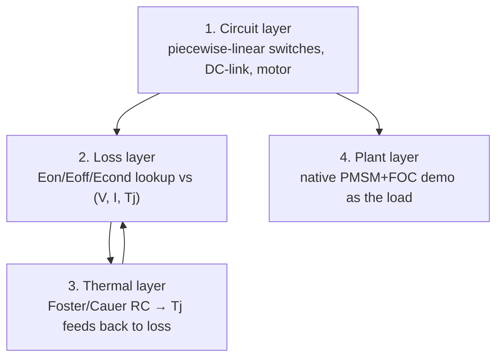

# Simulation & Validation

> How to model and validate a traction-inverter design. The project's simulator is **PLECS only** (MATLAB dropped) [80][58]. This chapter is the *model side* of V&V — how PLECS represents the inverter, and the corner tests that turn a sizing spec ([[design-procedure]]) into evidence. The *hardware side* (double-pulse bench, HIL, EOL) lives in [[manufacturing-and-test]]; validation closes the loop against [[reference-designs-index]].

**Citation convention:** `[NN]` → [[citations]]; `[T]` → training knowledge.

## 1. Why PLECS, and Where It Stops

**PLECS is chosen** because it does together the two things a traction-inverter model needs: piecewise-linear switching-circuit simulation (fast, no SPICE convergence pain) *and* a coupled thermal network driven by device loss tables [58][80]. It ships native **PMSM (with saturation LUT) and induction-machine models plus an FOC traction demo**, so the plant is a library block, not a from-scratch build [80], [[machine-and-load]] §8. It is scriptable over XML-RPC (`PLECS.exe -server <port>`); an MCP wrapper exposes those calls as agent tools and sweeps designs by passing `ModelVars`, as in the PE-MAS PLECS MCP server [72][78][79]. The **verified** call surface is below.

**Where it stops:** PLECS is a circuit+thermal solver, not a 3-D field solver. It does **not** give you parasitic extraction, EMI radiated fields, mechanical stress, or CFD coolant flow — those need FEA/CFD tools (§5) and, ultimately, hardware. Loop inductance `Lσ`, CM-capacitance, and EMI spectra enter PLECS only as *numbers you supply from elsewhere*, not results it derives [T], [[emi-emc-design]].

### Driving PLECS headless — verified surface (PLECS 4.8, 2026-07-18)

Confirmed by directly driving the installed Standalone build (basis for [[worked-example-family-car-400v-sic]] §7):

- **Launch:** `PLECS.exe -server 1080` starts the XML-RPC server (blocking, one request at a time — batch or run parallel instances on separate ports).
- **Methods present:** `plecs.load`, `plecs.set`, `plecs.get`, `plecs.simulate`, `plecs.getModelTree`, `plecs.scope`, `plecs.statistics`, `plecs.analyze`, `plecs.codegen`, `plecs.close`. **No circuit-building or script-eval methods** — `plecs.add`/`connect`/`eval` are **absent in 4.8** (PE-MAS probes for them because they are build-dependent [72]). ⇒ **parameterize a `.plecs` template; you cannot assemble a netlist over RPC.**
- **Readback gotcha:** `plecs.simulate('model')` returns `{Time, Values}` where `Values` come **only from top-level Outport blocks**. A scope-only model returns **empty** — a template must expose an Outport for *every* signal the summarizer reads ([[plecs-harness]] §4).
- **`.plecs` is ASCII:** `Component{Type,Name,Position,Parameter{Variable,Value}}` + `Connection{SrcComponent,SrcTerminal,Dst…}`; parameters live per-block or in a model-level `InitializationCommands` script. Retarget by text-replacing `Value` fields or via `plecs.set`. Library/`Reference` blocks carry parameter overrides (e.g. PMSM `R`, `L=[Ld Lq]`, `phi`, `p`).
- **Demo library = ready templates** [80] to seed from: `permanent_magnet_synchronous_machine` (clean 2L-VSI + PMSM + FOC, ~1500 lines), `electric_vehicle_with_active_damping` (full EV drive), `look_up_table_based_pmsm` (saturation LUT), `two_axle_vehicle_with_driving_profile`, `induction_machine_drive_controlled_with_dtc`.

## 2. How PLECS Models the Inverter — the Four Layers

| Layer | What it is | Where the data comes from | Cite |
|-------|-----------|---------------------------|------|
| **Circuit** | ideal PWL switch (on-R, threshold, off = open); DC-link cap+ESR/ESL; 3-phase bridge | topology from [[circuit-topologies]] | [58] |
| **Loss** | 3-D lookup: `Eon,Eoff = f(Vblock, I, Tj)` and `Vf/Rds = f(I, Tj)` — the *thermal description* | **datasheet DPT curves** of the chosen module (e.g. CAB450M12XM3 [92]); extracted by double-pulse [133] | [58][133][25] |
| **Thermal** | Foster (fit to datasheet Zth) or Cauer (physical layers) RC chain; junction→case→cooler | datasheet `Zth,jc`; TIM+cold-plate `Rth` [101] | [101][143] |
| **Plant** | native PMSM (dq + saturation LUT) + FOC controller demo | PLECS library; machine params from [[machine-and-load]] §3 | [80] |

**The loss↔thermal coupling is the point.** Loss raises `Tj`; higher `Tj` raises `Rds(on)` and switching energy; that raises loss again. A model with a *fixed* `Tj` understates hot-corner loss — the coupled network is what makes the efficiency and `Tj` numbers trustworthy [25][58]. Loss tables are **only as good as the datasheet DPT data**; a bench double-pulse on the real module is what closes the gap [133], [[manufacturing-and-test]] §3.

## 3. Model Fidelity — Switching vs Averaged

Pick the coarsest model that answers the question; the two live in one file [T][58]:

| Model | Timestep | Answers | Blind to |
|-------|----------|---------|----------|
| **Switched** (every edge resolved) | ~10–100 ns | switching loss, THD, dv/dt-at-node, ripple, dead-time | slow — minutes per electrical second |
| **Averaged** (duty-cycle sources) | ~10–100 µs | drive-cycle efficiency, thermal over a cycle, control stability | anything inside a switching period |

A full **WLTP cycle** (~1800 s) is only tractable in the averaged model; the switched model validates the loss/thermal tables at a handful of operating points that the averaged model then reuses [T][63]. This two-tier approach (switched for point accuracy, averaged for cycle coverage) is standard practice [63][143].

## 4. The Corner-Test Matrix — What to Actually Simulate

A design is "PLECS-validated" only when it survives these runs. Each maps to a design-procedure step and a pass criterion:

| # | Test | Setup | Pass criterion | Ties to |
|---|------|-------|----------------|---------|
| 1 | **Double-pulse (virtual)** | switched, one leg, clamped inductive load | Eon/Eoff, `Vds` overshoot within device SOA | [[design-procedure]] §2–3 |
| 2 | **Efficiency at 3 corners** | switched, low-line / nominal / high-line | η matches hand estimate ±; loss split sane | design-proc §3 |
| 3 | **Thermal / continuous** | coupled, hold `Is,max` launch | `Tj` < 175 °C at `Zth`-limited duration | §2, thermal-design §6 |
| 4 | **DC-link ripple** | switched, worst `m`/cosφ | `I_cap,rms` < rating; ΔVdc < 1–2% | design-proc §4 |
| 5 | **Overmodulation / six-step** | switched, MI > 0.907 | fundamental & THD vs field-weakening need | [[control-schemes]] §4.4 |
| 6 | **Field-weakening sweep** | plant, speed 0→max | torque holds ~1/ω; current within limit | machine-and-load §5 |
| 7 | **Fault: short-circuit** | switched, shoot-through | fault current & `I²t` vs SCWT budget (<3 µs) | [[protection-and-safety]] §3 |
| 8 | **Fault: ASC entry** | plant, short all low-side at speed | entry transient, drag torque, no bus overvolt | protection-and-safety §5 |
| 9 | **Drive-cycle** | averaged, WLTP/US06 | cycle-average η; `Tj` history for lifetime | reliability-and-lifetime |

**Corner 2 is the handoff contract:** [[design-procedure]] declares its closed-form efficiency/THD/thermal numbers *provisional* until PLECS reproduces them at these three line corners [80]. Corner 9 feeds the `Tj` mission profile into the rainflow→Miner lifetime pipeline [143], [[reliability-and-lifetime]].

## 5. Tool Landscape (PLECS-first, others for what PLECS can't do)

| Tool | Role here | Why not primary |
|------|-----------|-----------------|
| **PLECS** | circuit + thermal + machine — the workhorse [58][80] | — |
| MATLAB/Simulink | *dropped* as sim backend; controls-design reference only | not PE-switching-optimized; licensing/agent-cost [79] |
| ANSYS Maxwell / Icepak, COMSOL | EM parasitic extraction, CFD coolant, magnetics | slow; feed *numbers into* PLECS, not replace it |
| JMAG / Motor-CAD | machine FEA → flux maps (`Ld,Lq,λ` vs i) | supplies the saturation LUT PLECS consumes [80] |
| Typhoon / dSPACE / OPAL-RT | real-time HIL — see [[manufacturing-and-test]] §5 | hardware-in-loop, not desktop design |

*Sources: Plexim PLECS docs [58][80] [Reliability: High/vendor]; Ordonez AI+PLECS [79] [Medium]; Zhang & Negri AI multi-physics [63] [High].*

## 6. Pain Points (why this is not push-button)

1. **Loss tables gate everything.** Wrong DPT data → wrong η and `Tj`; must trace to the *orderable* module datasheet, ideally bench-verified [133].
2. **Switched↔averaged handoff** loses detail; the averaged model inherits any error in the point-validated tables [63].
3. **Parasitics are exogenous.** `Lσ`, CM-cap, and EMI come from layout/FEA, not PLECS — a PLECS-clean design can still fail EMC [T], [[emi-emc-design]].
4. **Machine params are provisional.** `[T]` IPMSM values (design-proc §0) swing torque/current; a real flux-map LUT is needed for MTPA/field-weakening accuracy [45][80].
5. **Sim ≠ silicon.** Every PLECS number is a hypothesis until double-pulse + HIL + dyno confirm it [133][134].

## Red Team

**Steelman against:** This chapter sells PLECS as *the* validator, but PLECS validates only the slice of the design that is a circuit+thermal problem. The failure modes that actually kill traction inverters in the field — EMC non-compliance, `Lσ` overshoot, bearing currents, power-cycling fatigue, control edge cases — are largely **outside** what PLECS resolves. Calling a design "PLECS-validated" risks false confidence: it means the loss/thermal/ripple math checks out with *assumed* device and machine data, nothing more.

**How it could be false:**
1. **Garbage-in on loss tables:** datasheet DPT is measured on a reference layout at a fixed `Lσ`; the real inverter's overshoot and `Eoff` differ — sim understates loss until bench-corrected [133].
2. **Machine model is linear-ish:** even the saturation LUT is FEA- or datasheet-derived; if that data is `[T]` (as in the anchor), corners 5–8 rest on placeholder physics [45].
3. **Averaged drive-cycle η** hides switching-period effects (dead-time distortion, reverse recovery) that shift real cycle loss by several %  [63].
4. **No EMC/parasitic coverage:** the biggest compliance risk (CISPR 25) is not in scope here — a structural gap, not a tuning error.
5. **Single-vendor lock-in:** "PLECS only" is a project decision [79], not an independent finding that PLECS is most accurate; a SPICE/FEA cross-check would strengthen any number.

**What would change my mind:** a PLECS 2L-B6 model whose efficiency, THD, and `Tj` at three corners match *measured* double-pulse + calorimetric data on the real module within a few %; a flux-map LUT from machine FEA replacing the `[T]` parameters.

**Residual doubt:** The *workflow* (four layers → fidelity choice → corner matrix → close against reference designs) is sound and is the right RAG substrate for an AI design agent. But "PLECS-validated" is a bounded claim: circuit + thermal + control, with EMC, parasitics, and fatigue explicitly out of scope and pushed to FEA and hardware.

---

> **References:** [[citations]]

← [[design-procedure]] | [[manufacturing-and-test]] | [[reliability-and-lifetime]] →
