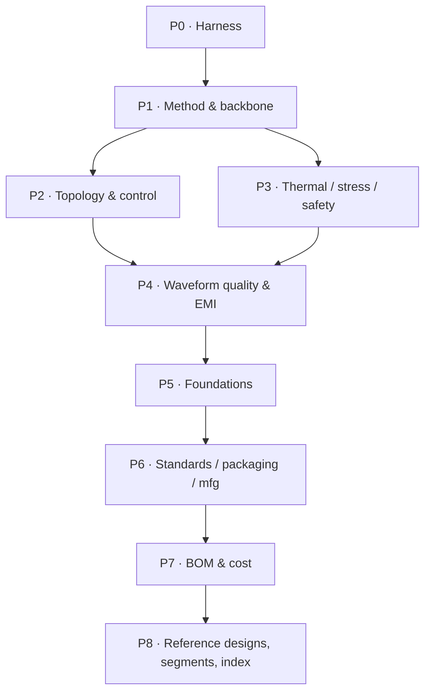

# Depth-research plan — PLECS-first

> **Mission.** Take every engineering-forward traction-inverter note to the depth of the reference ANPC study (extracted to `scratchpad/ref_notes.txt`): every component/node, every equation, sized values with reasoning, a **local PLECS run** that produces the numbers, honest data-quality caveats, and an explicit **safety** section — a **design → test → confirm-safety** guide.
>
> **The real gap is evidence, not authoring** *(audited 2026-07-19, all 31 notes read)*. The notes are already derivation-complete and every one carries a full Red Team with an explicit "what would change my mind." They are all `status: unverified` with numbers tagged `[T]`/`[derived]`. So the depth pass = **execute PLECS + pull the primary source named in each Red Team + upgrade `status`/`evidence`** — *not* re-writing design sections that already exist.
>
> **Order.** PLECS-hard notes first (Phases 0–4), research-only after (5–8). Every note is covered. Topic of [[ai-agent-mas-plan]]; runs on [[plecs-harness]]. Always cite: `[NN]`→[[citations]], `[T]`=training, `[derived]`=computed here. **Next citation: `[166]`.**

## Depth bar (the reference PDF, per note)

Topology + every switch/node → gate/PWM equations line-by-line → switching states + dead-time → filter derivation with transfer function + reactance/resonance → power/loss/efficiency with real numbers → solver + `.meas`/`.step` directives → what the run shows and what it does **not** prove → value-selection sweeps → validation workflow. Most notes already have the derivation beats; the pass adds the **PLECS-run** and **safety-margin** beats and replaces soft numbers.

## What each PLECS run can and cannot confirm  *(audit result — read before scoping any test)*

PLECS is a circuit+thermal+machine solver. It validates the circuit/thermal slice with *assumed* device and machine data — not EMC compliance, parasitics, fatigue coefficients, or standards limits (those need bench/FEA/standard texts). Per-note PLECS fit, ranked:

| Note | PLECS **confirms** | PLECS **cannot** (→ primary/bench) |
|------|--------------------|-------------------------------------|
| thermal-design | loss→Foster/Cauer→Tj chain (worked ΣRth 0.174 K/W→Tj 152 °C); Zth overload; DSC sensitivity | cold-plate Rth-vs-flow, real BLT (datasheet/measure) |
| control-how-to / control-schemes | Id/Iq step (settle 1–2 ms, <20% OS), THD_i<5%, torque ±5%, η, SVPWM +15.5%, DPWM ~33%, six-step, field-weakening V-limit | IMC-vs-dyno gain accuracy, MCU/codegen/HIL, "≈100% use FOC" |
| design-procedure / reference-design-2l-b6 | η/loss-split/Tj/ripple at 3 corners (the `[derived]` 99.3%/112 °C/115 A) | real module DPT tables, real IPMSM params |
| circuit-topologies | 2L vs 3L-NPC/TNPC/ANPC η, THD, dv/dt, NP-balance at equal op point | production-cost multipliers, market shares |
| gate-driver | **double-pulse only**: Vds overshoot `Lσ·di/dt`, dv/dt & Eon/Eoff vs Rg | `Ig,peak`/`Pdrive` (algebra), CMTI, creepage, SCWT (bench/datasheet) |
| protection-and-safety | **ASC/freewheel transient + regen overvoltage/chopper only**; SC fault current/energy vs SOA | cosmic-ray SEB knee, FTTI, ISO 26262/AQG qual (standards/neutron) |
| reliability-and-lifetime | **only the loss→Tj(t) mission-profile front-end** (shares thermal's model) → rainflow bins | Nf/Coffin-Manson/LESIT/CIPS08 coeffs, Miner LC (fatigue data) |
| emi-emc-design | **qualitative only**: i_CM=C·dv/dt, filter corner/attenuation, reflected-wave ~2× | CISPR 25 dBµV compliance, real spectrum, CM-impedance (LISN bench) |
| machine-and-load | saturation-LUT torque within a few % across the map | proprietary/`[T]` Ld/Lq/λ without a datasheet or FEA flux map |

**Corollary:** `reliability` and `thermal` share one loss→Tj(t) PLECS model — build it **once** in P3. Scope `gate`, `protection`, `emi` tests to the confirmable subset above and label the rest bench/standard territory.

## Environment & tooling

| Thing | Detail |
|-------|--------|
| Repo | `D:\Engineering Projects\AI\SRTP_PowerElectronicsAI` — git `main`, user Ferrell. Commit only when asked. Python 3.12. |
| **PLECS MCP** | Server `plecs` (installed 2026-07-19, memory `plecs-mcp-setup`). Launch engine: `PLECS.exe -server 1080` from `C:\Users\ferre\OneDrive\Documents\Plexim\PLECS 4.8 (64 bit)`; RPC `http://localhost:1080`. Tools: `mcp__plecs__ping/open_model/simulate/simulate_advanced/get_component_param/set_component_param/set_component_params_batch/run_script/rpc_call/rpc_batch/circuit_patch/discover_capabilities/list_methods`. |
| PLECS constraints (verified) | Surface = `plecs.load/set/get/simulate/getModelTree/scope/statistics/analyze/close`. **No `plecs.save`** → structural edits are **`.plecs` text then `open_model`**. **No `plecs.add/connect`** → param tuning only via RPC. **Readback only from top-level Outport blocks.** Single-request/blocking → serialize or extra instances on ports 1081+. |
| Online research | `WebSearch`; `obsidian:defuddle` (web→markdown); `WebFetch` (.md/direct). Prefer primary/peer-reviewed → datasheet → standard → vendor; label reliability per [[SCHEMA]]. |
| Cross-check | numpy models in `worked-designs/*.py` (`familycar_inverter.py` pattern) bound every PLECS number. |
| Subagents | Parallel primary-source gathering (one topic each → dense cited brief + proposed `[NN]` + own red-team). **Author `citations.md` centrally.** PLECS does **not** parallelize on one port. |
| Seed artifacts | `worked-designs/family-car-400v-sic/pmsm_mycar.plecs` (already the retargeted PLECS PMSM+FOC demo). Demo templates named in [[simulation-and-validation]] §1 (`permanent_magnet_synchronous_machine` ~1500 lines, `look_up_table_based_pmsm`, `electric_vehicle_with_active_damping`). |

## The loop (per note)

```mermaid
flowchart LR
    A["pick note +<br/>its Red-Team 'what would<br/>change my mind'"] --> B["pull that primary<br/>source (WebSearch/defuddle)"]
    B --> C["extend the P0 template<br/>(.plecs text)"]
    C --> D["run the confirmable<br/>subset (mcp__plecs__simulate)"]
    D --> E["cross-check numpy +<br/>named reference"]
    E --> F["replace [T]/[derived] →<br/>[NN]/sim; add safety margins"]
    F --> G["re-run Red Team,<br/>status/evidence++"]
    G --> H["validate links+frontmatter,<br/>update model_registry"]
```

## The depth pass, per note (what to ADD — derivation already exists)

1. **PLECS test** — extend the P0 template; top-level Outports; the **confirmable subset** (table above); results table at the 3 bus corners (550/750/850 V); a data-quality caveat naming what the run does not prove.
2. **Replace soft numbers** — swap each `[derived]`/`[T]` for the sim result or the primary source the Red Team names; upgrade `status`/`evidence`.
3. **Safety limits & margins** — SOA, Vds & Tj margins, creepage, dv/dt, fault behavior. Tighten the mostly-present safety content into an explicit section.
4. **Re-run Red Team** to the *residual* doubt; bump `review_by`.

Leaves behind: PLECS artifact(s) under `worked-designs/…`, a `data/plecs/model_registry.json` entry, new `citations.md` entries.

## Phased TODO — all 31 notes  *(☐ todo · ◐ wip · ☑ done)*

### Phase 0 — Harness bring-up  *(enabler; extend, don't build)*
- ☐ Extend `pmsm_mycar.plecs` (already the retargeted PMSM+FOC demo) into a **2L-B6 SiC template** with **top-level Outports** (η, P_cond/P_sw, THD, Tj, ripple, Vds) + a Foster/Cauer thermal net + datasheet-class loss tables. Prove `mcp__plecs__simulate` returns `Values` (the last `simulate` errored — this is the Outport/readback blocker). **Calibrate against the measured [[reference-design-wolfspeed-ti-300kw-800v]] anchor: >98 % η, 32 kW/L, 360 A rms, 175 °C, 5.3 nH** within ±1 pt η / ±10 % loss. Deliverables: `worked-designs/templates/2l_b6_sic_pmsm.plecs`, `data/plecs/model_registry.json`. Refs: [[plecs-harness]], [[simulation-and-validation]] §1–2.

### Phase 1 — Method & backbone  *(PLECS)*
- ☐ **[[simulation-and-validation]]** — the 9-corner matrix, PLECS surface, and Outport contract are **already written** (§4). Task: **execute** the matrix on the P0 template, record results, upgrade `status` unverified→(supported if it matches Wolfspeed). Don't re-author the method.
- ☐ **[[design-procedure]]** — replace the `[derived]` op-points (η≈99.3 %, Tj≈112 °C, I_ph 192/300 A, I_cap 115 A) with PLECS values at 3 corners; cross-check `familycar_inverter.py`. Also updates [[reference-design-2l-b6-sic-800v]] and `trials/worked-example-400v-150kw`.
- ☐ **[[machine-and-load]]** — replace `[T]` Ld/Lq/λPM with a real IPMSM datasheet **or** a PLECS `look_up_table_based_pmsm` saturation LUT; §8 already points at the demo. Every op-point inherits this.

### Phase 2 — Topology & control  *(PLECS)*
- ☐ **[[circuit-topologies]]** — the 2L/NPC/ANPC/TNPC structures + switching-state tables **already exist**; task: quantitative **2L-B6 vs 3L-NPC/TNPC/ANPC** at equal op point (η, THD, dv/dt, NP-balance) to replace the "approximate/unverified" 97.5/98.7/99.0 % ranges and test the [28] 0.67 kWh/100 km claim. `.plecs` text variants.
- ☐ **[[schematics]]** — fold the validated PLECS topology in; it *is* the schematic. Low new-content; mostly cross-link to P2 models.
- ☐ **[[control-how-to]]** (+ **[[control-schemes]]**) — build the FOC/SVPWM drive sim; control-how-to already lists the pass/fail targets (settle 1–2 ms, THD<5 %, η 96–99 %). Verify SVPWM +15.5 %, DPWM ~33 %, six-step, field-weakening. Retune from `pmsm_mycar.plecs`.

### Phase 3 — Thermal / stress / safety  *(PLECS — one shared model)*
- ☐ **[[thermal-design]]** — highest-value, self-requested: reproduce the ΣRth 0.174 K/W → Tj 152 °C chain + Zth overload + DSC sensitivity. **This model's loss→Tj(t) front-end is reused by reliability.**
- ☐ **[[reliability-and-lifetime]]** — do **not** build a separate sim; run the thermal model over WLTP/US06 to emit **Tj(t) → rainflow bins**, then feed the (non-PLECS) Nf/Miner models. PLECS validates the *input trace*, not the lifetime.
- ☐ **[[gate-driver-design]]** — scope the PLECS test to a **double-pulse**: Vds overshoot, dv/dt & Eon/Eoff vs Rg. Leave `Ig,peak`/`Pdrive` as algebra; the true validator is a bench double-pulse (note this).
- ☐ **[[protection-and-safety]]** — scope to **ASC/freewheel transient + regen overvoltage/chopper** (thresholds 1170/1140/1250 V) + SC fault current/energy vs SOA. The cosmic-ray/FTTI/qual derating table stays standards/datasheet-sourced, not sim.

### Phase 4 — Waveform quality & EMI  *(PLECS — pre-compliance only)*
- ☐ **[[emi-emc-design]]** — softest fit: demonstrate i_CM=C·dv/dt scaling, filter corner/attenuation (CM ~9.5 kHz/DM ~65 kHz, 60/40 dB @300 kHz), reflected-wave ~2×. **Label pre-compliance illustration, not CISPR 25 validation** (that needs a LISN bench scan + purchased limit tables).
- ☐ Refresh `trials/worked-example-400v-150kw` with the now-PLECS-backed numbers.

### Phase 5 — Foundations  *(research; 2 notes carry sim claims)*
- ☐ **[[components]]** — has the **most PLECS-validatable claims of the research tier** (SiC 50–70 % loss delta, DC-link ripple sizing — the note itself says "verify with simulation," Lσ overshoot/ringing). Validate these with the P1–P3 runs; the rest (part numbers, market) is datasheet/market.
- ☐ **[[what-is-a-traction-inverter]]** — efficiency-by-fsw, dv/dt, ripple, <50 ms torque response are sim-adjacent; confirm via the same runs. Fundamentals prose otherwise.
- ☐ **[[materials-and-properties]]** — correctly no-PLECS: temperature-dependent property curves from datasheets replace the 25 °C singletons.

### Phase 6 — Standards / packaging / mfg  *(research; no PLECS)*
- ☐ **[[standards-and-compliance]]** — purchase/verify IEC 61800-5-1 + IEC 60664-1 creepage tables, CISPR 25:2021 limits, ISO 26262 metrics, AQG 324 cycles. Pure standards text.
- ☐ **[[packaging-and-layout]]** — Lσ is an extraction/measurement (Q3D) quantity, not a PLECS output; module stack/creepage are datasheet/standard.
- ☐ **[[manufacturing-and-test]]** — process/test note; the double-pulse/MIL-SIL/HIL content is the *bench* counterpart to the P3 sim (sim-adjacent, but the note documents physical test).

### Phase 7 — BOM & cost  *(research)*
- ☐ **[[bom]]** + **[[bom-price-database]]** — full board BOM from TI TIDUF23A; live DigiKey/Nexar pricing with as-of dates (verified anchors: CAB450M12XM3 $898.44, UCC5880-Q1 ~$11, AURIX TC397 $78.26).
- ☐ **[[design-tradeoffs]]** — **more than synthesis**: its step 5 and Red Team demand a **PLECS Pareto sweep** (efficiency×cost×density across device/voltage/fsw/topology). Do the sweep once P1–P4 models exist; keep the qualitative trade-map as synthesis.

### Phase 8 — Reference designs, segments, index  *(read/verify — don't rewrite)*
- ☐ **Reference designs — not equal anchors.** [[reference-design-wolfspeed-ti-300kw-800v]] = the measured calibration anchor (P0). [[reference-design-2l-b6-sic-800v]] = the spec to *validate* (its numbers are self-declared `[derived]`/`[T]`). [[reference-design-tesla-model3-400v-sic]] + [[reference-design-nissan-leaf-400v-igbt]] = device-choice/volume-cost context, **no published η/THD/Tj** (Leaf is low-reliability teardown) — verify teardown facts, don't treat as numeric anchors. [[reference-designs-index]] = map.
- ☐ **Segments** — [[segment-low-cost-city-car-inverters]] · [[segment-heavy-duty-truck-inverters]] · [[segment-performance-motorsport-inverters]] = market landscape / RAG backbone feeding worked-examples; no calibratable sim numbers (internals inference/undisclosed). Verify market facts only.
- ☐ **[[open-problems]]** (its Q1/Q2/Q5 are PLECS-answerable — they seed P1–P4 tasks) · **[[traction-inverter-index]]** (regenerate the reading-order map after the above land).

## Definition of done (per note)

Target claims **PLECS-backed or primary-cited** (or explicitly bounded/refuted) for the *confirmable subset*; each `[T]`/`[derived]` replaced with source + conditions or flagged bench-only; a runnable PLECS artifact + `model_registry` entry exist (Tier 1); `status`/`evidence` updated; **Red Team re-run to the residual doubt**; links + frontmatter validate. A number is evidence only if its model is `validation_status: validated` in the registry ([[plecs-harness]] §3).

## Gotchas

- **Readback:** scope-only models return empty `Values` — Outports mandatory (the P0 blocker).
- **Concurrency:** one PLECS port is blocking — never fan serial PLECS calls from parallel subagents.
- **No `plecs.save`:** structural edits are `.plecs` text then `open_model`.
- **Model fidelity:** the generic SiC switch model has no real Eon/Eoff/Coss/temperature — efficiency isn't production-accurate until calibrated loss/thermal tables are loaded (reference PDF §5). State this in every efficiency caveat.
- **Don't over-claim PLECS:** for gate/protection/emi/reliability, PLECS confirms only the subset in the table above — the rest is bench/standard/datasheet.
- **Historical `log/` files** reference the old structure — do not "fix" them. Linter re-stamps frontmatter (benign); git warns LF→CRLF (benign).

← [[ai-agent-mas-plan]] | [[plecs-harness]] | [[simulation-and-validation]] | [[traction-inverter-index]]
