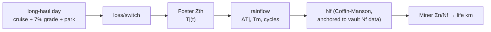

## What This Is

A worked example whose **workflow is the point**: a Class-8 long-haul e-truck inverter is **not** sized by 0–100 peak (that's the family car, [[power-electronics/traction-inverter/worked-example-family-car-400v-sic]]) — it is sized by **power-cycling life over ~1 M km under sustained load**. The workflow is the physics-of-failure chain from [[power-electronics/traction-inverter/reliability-and-lifetime]]: mission → loss → Foster `Tj(t)` → rainflow → `Nf` → Miner `LC`. Runnable model: `worked-designs/truck-800v-sic/truck_lifetime.py`.

**Citation convention:** `[NN]` → [[citations]]; `[T]` → training/undergrad; `[model]` → computed by the script; web specs tagged **[H]/[M]/[mkt]** as in [[citations]].

## 1. The Application (real-grounded)

Full sourced survey: [[power-electronics/traction-inverter/segment-heavy-duty-truck-inverters]]. Long-haul BEV tractors converge on **continuous power ~400 kW, peak ~600 kW** — the *opposite* emphasis from a car (huge brief peak). Mercedes eActros 600: **800 V, 600 kW peak / 400 kW continuous**, 621 kWh LFP [162][H]. Tesla Semi: 800 kW peak / ~525 kW sustained / ~1000 V [163][mkt]. **The "everything is 800 V" premise is only half true** — eActros/MAN = 800 V, Tesla Semi ~1000 V, Volvo FH <750 V, Freightliner eCascadia 400 V [163]. DOE's HEP program states the intent outright: **"800 V, 250 kW *continuous* SiC inverter… for high continuous loads and the shock/vibration of heavy-duty trucks"** [161][H].

| Item | Value | Basis |
|------|-------|-------|
| Bus | 800 V | eActros-class [162] |
| Power | 600 kW peak / **400 kW continuous** | [162] |
| Device | 1200 V SiC, **double-side-cooled sintered** module | HD direction [161][163] |
| GVW / mission | ~37–40 t; sustained cruise + **Davis-Dam 7% grade** climbs | [163] |
| Life target | **~1 M km / 8 yr** | Renault E-Tech T warranty [163][H] |

## 2. The Workflow — Lifetime, Not Peak  `[model]`

Result (cost-sized module, `Rth`≈0.24 K/W, `Tj` swings **25→140 °C**):

| Damage cycle | ΔTj | count/day | Nf | **share of damage** |
|--------------|----:|----------:|---:|--------------------:|
| **Daily cold-start** (park-cold → operate-hot) | **115 K** | 1 | 5,300 | **97%** |
| Grade soak (7%, ~17 min, 350 kW) | 56–59 K | ~3–6 | 1.2–2.5×10⁵ | 3% |

**Life ≈ 4.4 M km — passes the 1 M km target ~4×** [model]. **Sizing sweep:** because `Nf ∝ ΔTj⁻⁵`, a **+15% silicon/cooling** upsize (Tj,max 140→125 °C) moves *predicted* life ~100×. Life is therefore **hyper-sensitive to ΔTj** — you design to a **Tj/ΔTj ceiling**, not to an absolute km number.

## 3. Circuit / Device / BOM (deltas from the car)

2L-B6, but sized for **continuous** current (~430 A rms at 400 kW/800 V) and **million-km fatigue**, not launch: **double-side-cooled, sintered-Ag, Cu-clip 1200 V SiC** module (Infineon HybridPACK DSC / Danfoss DCM class [163]) — the interconnect stack chosen for power-cycling life ([[power-electronics/traction-inverter/reliability-and-lifetime]] §6). Hotter coolant (~75 °C) tolerated; ruggedized for shock/vibration [161]. Control (FOC/SVPWM/ASC) is the same family as [[power-electronics/traction-inverter/control-how-to]]; the *thermal-management + derating* loop ([[power-electronics/traction-inverter/thermal-design]] §6) is where the effort goes.

## 4. New Knowledge  `[model]`

1. **The daily cold-start dominates power-cycling damage (97%), not the dramatic grade climbs.** The 350 kW Davis-Dam grade rides on an *already-warm baseplate* (ΔTj~57 K), while parking overnight relaxes the die to ambient → the mundane 115 K daily on/off cycle is the killer. Non-obvious, and it redirects the design: manage the *parked-to-operating* swing (pre-conditioning) as much as the peak.
2. **Absolute life is coefficient-dominated and nearly meaningless (±1–2 orders).** A ±15% thermal change swings predicted life ~100× (`ΔTj⁻⁵`). The robust deliverable is a **ΔTj/Tj ceiling with margin**, not "X million km."
3. **The vault's own LESIT closed-form is miscalibrated.** Using `A=640, Ea=0.617 eV` (reliability-and-lifetime.md §3) gives **~20 cycles at ΔTj=100 K** — physically absurd. I anchored Coffin-Manson to the note's *empirical* Nf datapoint (110 k cycles @ 50 K) instead. The vault's Red Team flagged coefficient risk; this **confirms it quantitatively** — a fix the vault should absorb.

## 5. Report — Compromises

- **Sized by continuous + fatigue, not peak.** The module is bigger/better-cooled than peak power alone needs, bought to cap ΔTj for 1 M km. Cost/mass up; it's the price of the mission.
- **Hot coolant + high continuous Tj** trades efficiency headroom for packaging; acceptable because the truck's binding metric is life, not the last 0.3% efficiency.
- **SiC over IGBT** for continuous-load efficiency (~4% mission gain [163]) and the double-side-cooled reliability stack — the opposite reasoning from the microcar's cost-first IGBT/MOSFET.
- **Process contrast:** where the family car's workflow converged on *efficiency at 3 voltage corners*, this one converges on *ΔTj over a mission* — a different model (rainflow+Miner), a different binding constraint (fatigue), a different sizing rule (Tj ceiling). See the 4-way comparison in [[ai-agents/design-by-doing-observed-workflow]].

## Red Team

**Steelman against:** Almost every number is soft. Device loss params are invented `[T]`; the mission is synthetic; the Nf calibration is anchored to *one* IGBT datapoint and scaled by an assumed sintered-module uplift (×3) — so "4.4 M km" could be 0.5 M or 40 M. The truck specs themselves mix OEM `[H]` with press `[mkt]` ("525 kW continuous," ">2M cycles" are not real ratings [163]). And Miner's rule is the least defensible link in the chain (vault Red Team).

**How it could be false:**
1. **Coefficient dominance:** the whole absolute life rests on Coffin-Manson `n` and the anchor Nf; both are technology-specific and unvalidated for the (invented) module [139][142]. The *ranking* (cold-start dominates) is robust; the *magnitude* is not.
2. **Cold-start ΔTj = 115 K assumes overnight relaxation to 25 °C ambient** — a truck kept plugged/pre-conditioned, or in a warm climate, has a much smaller daily swing, changing finding #1's magnitude.
3. **`Tj,max=140 °C` is a chosen operating point;** run cooler and life balloons, run hotter and it collapses below target — the model can be tuned to any answer, which is exactly the point about coefficient sensitivity.
4. **Miner `LC=1`** ignores sequence/creep coupling; real failures scatter 0.3–3× [139].

**What would change my mind:** an AQG 324 power-cycling dataset for the actual chosen SiC module + a CIPS08 fit; a measured Tj mission profile from a real HD inverter; the official VECTO long-haul cycle replacing the synthetic mission.

**Residual doubt:** The *workflow* (mission→rainflow→Miner) and the two directional findings (cold-start dominates; life is a ΔTj-ceiling problem, not a km number) are solid and genuinely useful. Every absolute figure is a coefficient-driven hypothesis — here more loudly than in any other example, because power-cycling models are the least transferable numbers in the vault.

---

> **References:** [[citations]] · model: `worked-designs/truck-800v-sic/`

← [[power-electronics/traction-inverter/worked-example-family-car-400v-sic]] | [[power-electronics/traction-inverter/reliability-and-lifetime]] | [[power-electronics/traction-inverter/worked-example-performance-800v-sic]] →
