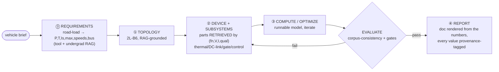

# Observed Design Workflow — What Four Design Passes Teach the MAS

On 2026-07-18 a single agent ran **four complete** traction-inverter designs by hand — a **family car** (400 V SiC, efficiency), a **Class-8 truck** (800 V SiC, lifetime), a **hypercar** (800 V SiC, power density), and a **city microcar** (96 V LV-MOSFET, cost) — each vehicle → spec → circuit → device → thermal → control → BOM → model-run → report, RAG-limited to the traction-inverter vault + undergrad physics (web allowed for the last three). This note extracts the **process** and maps each element to a MAS requirement, so [[ai-agent-mas-plan]] can build what worked. Companion to [[design-loop-architecture]] (loop derived from *published* systems); this derives it from **four observed runs**. Engineering output: [[worked-example-family-car-400v-sic]], [[worked-example-truck-800v-sic]], [[worked-example-performance-800v-sic]], [[worked-example-microcar-96v-mosfet]].

**Up front: n = 4** (one agent, four objectives), reconstructed partly post-hoc — hypothesis-rich field notes, not a validated methodology (Red Team). The four passes below let §"Four Passes" generalise beyond the single family-car run.

## The Observed Pipeline (mapped to plan roles)

Roles today: **Planner**=①, **Designer**=②③, **Validator**=evaluate ([[design-loop-architecture]] §4). The pass shows the loop needs **two cheap bookends** — ⓪ and ④ — neither a new *core* agent (AgentSlimming holds).

## The Gold Nuggets (particular → MAS requirement)

| # | What the pass actually did | MAS requirement | Plan status |
|---|----------------------------|-----------------|-------------|
| 1 | **Derived** the spec from the vehicle (road-load eqn → 135 kW/345 Nm, `Is,max`≈400 A, speeds, 400 V class) — did not accept it as given | **Stage ⓪ Requirements** upstream of Planner: a `vehicle-brief → spec-vector` road-load tool | **NEW** (propose G-I). Loop starts at "spec"; hand-fed `Is,max` is an error source (prior worked examples *guessed* it) |
| 2 | **Retrieved** parts, never generated them: keyed `(function, V-class, I-class, auto-qual)` → nearest vetted part in [[components]]/[[bom]] → `{spec, sizing-driver, cite}`; mapped 1200 V→750 V *within the same family* (HybridPACK Drive). Zero web calls, zero hallucinated MPNs | **Parts-retriever tool** for the Designer over the component KB + DigiKey/Nexar live adapters; the LLM sets *constraints*, the tool returns the *part* | **NEW** (G-J). Only implicit via BOM adapters. LLMs hallucinate MPNs if asked to *generate* |
| 3 | **Computed before writing**; ran the model, iterated, *then* wrote the note from its output | **Reporter (④) consumes only the summarizer's numbers + a run-id**; forbid the LLM narrating plausible numbers | Reinforces invariant #3 + G-E; adds explicit downstream doc-gen step |
| 4 | **Provenance-tagged every number** (`[model]/[derived]/[T]/[NN]`) | Make provenance a **typed field on every emitted quantity**; the evidence gate **refuses to close on `[T]`/assumed** values | **NEW** (G-K). Runtime enforcement of the vault status/evidence schema |
| 5 | **Sensitivity steered effort** — the headline SiC-vs-IGBT result hinged on one input (the `Esw` ratio); flagged it | Cheap **sensitivity step** (perturb each input, watch the summary) → tells the loop *which input to spend a datasheet/web call on* vs accept a class-typical | **NEW** (G-L). Feeds data-acquisition priority + the optimizer |
| 6 | **Cheap corpus-consistency check** before any sim: computed η / loss-split vs the KB's stated ranges & directions ([28], worked-example-400v) | **RAG-consistency pre-gate** before the Validator spends a PLECS batch — near-free, catches gross errors | **NEW** (G-M). Complements the evidence gate |
| 7 | **Cost-aware de-scope**: probed PLECS incrementally (launch→methods→readback→demos); when full retarget hit diminishing returns/risk, fell back to a bounded outcome | The **G-H stopping rule must cover exploration/tool-probing**, not just the optimizer: bound probe depth, return best defensible partial | Extends G-H; SimulCost/AgentSlimming [73][74] |
| 8 | **Iterated the artifact, not the prose** — compute→inspect→adjust→recompute (fixed a highway-heavy drive cycle) | Evaluator-optimizer loop runs on the **executable**; write once at the end | Confirms ③+evaluate |

## Two Bookends the 3-Agent Core Is Missing

Cheap, Orchestrator-owned steps — not new agents:
- **⓪ Requirements** (`vehicle → spec vector`): a road-load tool + undergrad-vehicle RAG. Without it, `Is,max` is a human guess and the whole sizing rests on it.
- **④ Reporter** (`summary → worked-example doc`, every number provenance-tagged): renders the human-facing artifact *from* the validated numbers, downstream of the Validator.

## Confirmed (not new)
- **Template + param-injection, not free-form authoring** — retargeted a *named* PLECS demo by `Value`/`plecs.set` (plan §2 ✓, [[plecs-harness]]).
- **Explicit compute over LLM re-guessing** — the model, not prose, produced the numbers (design-loop ③ ✓).
- **RAG-first grounding** — read the method files (procedure-design, machine-and-load, procedure-control, bom) *before* designing; the design instantiates the vault's method, it does not reinvent it.
- **3-agent core sufficient** — the bookends are Orchestrator-owned steps, not agents.

## Four Passes, Four Workflows — the Process Comparison

The pipeline *structure* (⓪→①→②→③→④) held across all four, but the **objective selected the analysis model, the binding constraint, and the first design move** — they were not the same design done four times:

| Pass | Objective | Binding constraint | Analysis model (the ③ that mattered) | First move / sizing rule |
|------|-----------|--------------------|--------------------------------------|--------------------------|
| **Family car** 400 V | drive-cycle efficiency | partial-load loss | loss map → **3 voltage corners + drive cycle** | pick device for cycle η |
| **Truck** 800 V | ~1 M km life | power-cycling fatigue | mission → Foster `Tj(t)` → **rainflow → Miner** | size to a **ΔTj/Tj ceiling** |
| **Hypercar** 800 V | kW/L + burst | transient thermal + volume | **`Zth(t)` pulse curve** + kW/L | minimum silicon + DSC; ration the peak |
| **Microcar** 96 V | absolute BOM cost | $/kW + current handling | **cost structure** + LV-vs-IGBT loss split | **pick bus voltage first (low)** |

**The load-bearing MAS finding:** a design agent cannot use one fixed analysis. The **Planner must select the workflow and the binding gate *from the objective*** — efficiency-corners vs rainflow-lifetime vs `Zth`-pulse vs cost-structure — before the Designer/optimizer runs. The design loop ([[design-loop-architecture]]) is objective-invariant in *structure* but objective-*selected* in its ③ analysis and its pass/fail gate. **Propose G-N: an objective→(analysis-model, binding-gate) selector in the Planner.** Corollary seen directly: microcar and hypercar sit at *opposite ends of the bus-voltage axis* for the *same* device physics — low V for cost, high V for efficiency/density — so "choose bus voltage" is an early, objective-driven branch, not a default. And the shared spine (RAG the method → derive operating points from the vehicle → runnable model → provenance-tag → red-team) held all four times — evidence the pipeline is workflow-general, not a family-car artifact.

## Red Team

**Steelman against:** n = 4, **one agent**, one domain (traction inverters), reconstructed partly post-hoc — this risks dressing up four improvised sessions as "methodology" and minting gap IDs (G-I…G-N) the plan may not need. Several nuggets (compute-before-write, provenance) are good-practice restatements already implicit in the plan's invariants. And #2 (parts = retrieval) is **only true inside the KB's coverage** — for a genuinely novel spec the retriever returns nothing and live-search/generation is unavoidable.

**How it could be false:**
1. **ⓠ Requirements may belong *inside* the Planner**, not as a separate stage — an org choice, not a finding.
2. **The consistency pre-gate can reject correct *novel* results** that legitimately depart from the corpus — a real false-negative risk; it must gate "gross-error" bands, not tight agreement.
3. **The sensitivity step can cost more than its value** on a ≤3-parameter design.
4. **Still one agent, one domain, post-hoc:** n=4 across objectives answers "is it just the family-car problem?" (the four workflows genuinely differed) but **not** "is it just *this* agent's habit?" — a second, independent agent could decompose the work differently. The stage boundaries may be my reconstruction, not an inevitability.

**What would change my mind:** the 2–3 additional passes this note's earlier (n=1) version asked for are now done and *did* reproduce the ⓪→④ spine while diverging at ③ — so that objection is largely met; what remains is an **independent** agent (or a real MAS run) reproducing the same boundaries, plus a logged case where the consistency pre-gate wrongly blocks a true novel result.

**Residual doubt:** The two bookends (ⓠ requirements, ④ reporter) and **parts = retrieval-not-generation** are the robust, actionable finds. Provenance-typing and cost-aware de-scope are sound but already near the plan. The new gap IDs are proposals to test, not settled — validate against a second design pass before wiring them in.

---

> **References:** [[citations]]

← [[design-loop-architecture]] | [[ai-agent-mas-plan]] | [[findings-family-car-design-by-doing]] | [[harness-index]]
